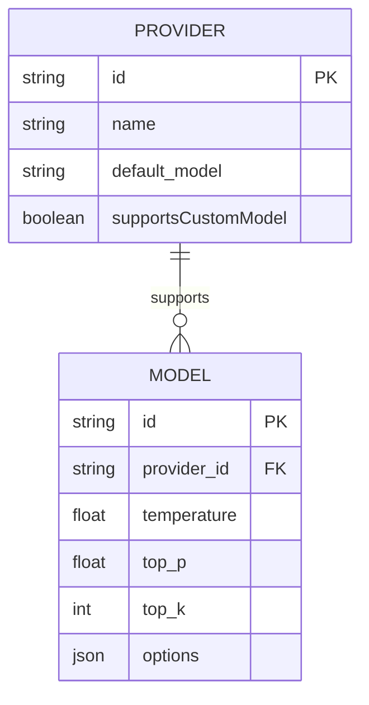
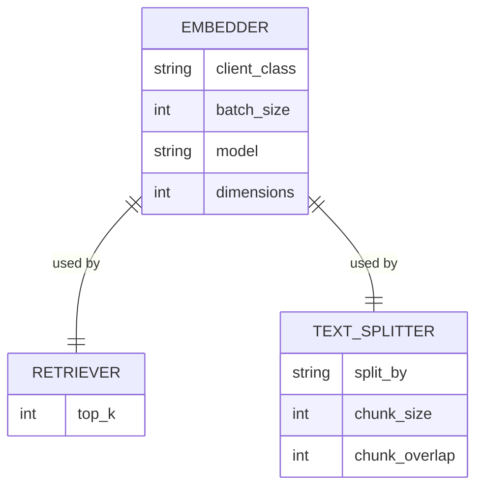

# 目录结构解析

<cite>
**本文档中引用的文件**  
- [generator.json](file://api/config/generator.json)
- [embedder.json](file://api/config/embedder.json)
- [lang.json](file://api/config/lang.json)
- [repo.json](file://api/config/repo.json)
- [main.py](file://api/main.py)
- [api.py](file://api/api.py)
- [rag.py](file://api/rag.py)
- [page.tsx](file://src/app/page.tsx)
- [route.ts](file://src/app/api/chat/stream/route.ts)
- [i18n.ts](file://src/i18n.ts)
- [zh.json](file://src/messages/zh.json)
- [Dockerfile](file://Dockerfile)
- [docker-compose.yml](file://docker-compose.yml)
</cite>

## 目录结构解析

本项目采用前后端分离的架构，前端基于 Next.js 框架构建，后端使用 FastAPI 提供服务。整体结构清晰，模块化程度高，便于开发者快速定位功能模块并理解代码组织逻辑。

### api/ 目录

`api/` 目录是项目的后端核心，包含所有服务端逻辑、配置和依赖。

#### api/config/ 配置文件

该目录下的 JSON 文件定义了系统的关键配置。

**generator.json**  
该文件定义了生成模型（LLM）的配置。它指定了默认的模型提供商（`default_provider`）以及各个提供商（如 `google`, `openai`, `openrouter`, `ollama` 等）所支持的模型列表。每个模型都配置了其特定的参数，如 `temperature`, `top_p`, `top_k` 等，用于控制生成内容的随机性和多样性。此配置是系统选择和调用大语言模型的核心依据。



**Diagram sources**
- [generator.json](file://api/config/generator.json)

**embedder.json**  
该文件配置了文本嵌入器（Embedder）和检索器（Retriever）。它定义了用于将文本转换为向量表示的模型（如 `text-embedding-3-small` 或 `nomic-embed-text`），以及相关的参数，如 `batch_size` 和 `dimensions`。同时，它还配置了检索器的 `top_k` 参数（返回最相关的前 K 个结果）和文本分割器（`text_splitter`）的参数（如 `chunk_size` 和 `chunk_overlap`），这些是实现 RAG（检索增强生成）功能的基础。



**Diagram sources**
- [embedder.json](file://api/config/embedder.json)

**lang.json**  
该文件定义了系统支持的多语言选项。`supported_languages` 字段列出了所有可用的语言及其显示名称（包括中文、日文、西班牙文等），而 `default` 字段指定了默认语言。此配置与前端的国际化功能紧密配合。

**repo.json**  
该文件定义了仓库处理的默认过滤规则。`file_filters` 字段中的 `excluded_dirs` 和 `excluded_files` 列表包含了默认会被忽略的目录和文件，例如 `node_modules/`, `.git/`, 各种锁文件（如 `package-lock.json`, `yarn.lock`）和构建产物。这有助于在分析代码库时排除无关文件，提高效率。

**Section sources**
- [lang.json](file://api/config/lang.json)
- [repo.json](file://api/config/repo.json)

#### api/ 核心逻辑模块

- **main.py**: 项目的入口文件。它负责加载环境变量、配置日志、检查必要的环境变量（如 `GOOGLE_API_KEY`），并最终启动 FastAPI 应用。它还包含了开发模式下的文件监听逻辑。
- **api.py**: FastAPI 应用的核心文件。它定义了所有的 API 路由，包括 `/chat/completions/stream`（流式聊天）、`/models/config`（获取模型配置）、`/api/wiki_cache`（读写 Wiki 缓存）和 `/api/processed_projects`（获取已处理的项目列表）等。它是前后端通信的桥梁。
- **rag.py**: 实现 RAG（检索增强生成）功能的核心模块。它整合了嵌入器、向量数据库（FAISS）和生成器，负责根据用户查询从代码库中检索相关信息，并结合这些信息生成回答。
- **\*.client.py**: 这些文件（如 `openai_client.py`, `google_embedder_client.py`）是与不同 AI 服务提供商（如 OpenAI, Google, Ollama）交互的客户端封装，负责处理具体的 API 调用。

**Section sources**
- [main.py](file://api/main.py)
- [api.py](file://api/api.py)
- [rag.py](file://api/rag.py)

### src/ 目录

`src/` 目录是项目的前端部分，基于 Next.js App Router 构建。

#### src/app/ 页面与路由

该目录的结构直接映射到应用的 URL 路由。

- **[owner]/[repo]/page.tsx**: 这是一个动态路由页面，用于展示为特定 GitHub/GitLab 仓库生成的 Wiki 内容。`[owner]` 和 `[repo]` 是动态参数。
- **api/chat/stream/route.ts**: 这是一个 API 路由，作为前端与后端 FastAPI 服务之间的代理。它接收来自前端的流式聊天请求，并将其转发给运行在 `localhost:8001` 的后端服务，然后将后端的响应流式传输回前端。
- **api/models/config/route.ts**: 另一个 API 路由，用于从后端获取模型配置信息（即 `generator.json` 中的内容），供前端 UI 选择模型时使用。
- **api/wiki/projects/route.ts**: 用于获取服务器上所有已缓存的 Wiki 项目列表的 API 路由，支持 GET 和 DELETE 方法。
- **page.tsx**: 应用的首页，包含仓库 URL 输入框、配置模态框和可视化示例。

```mermaid
graph TD
A[首页 page.tsx] --> |输入仓库URL| B[动态Wiki页 [owner]/[repo]/page.tsx]
A --> |获取模型配置| C[/api/models/config]
A --> |获取项目列表| D[/api/wiki/projects]
B --> |发起聊天| E[/api/chat/stream]
C --> F[后端 api.py]
D --> F
E --> F
```

**Diagram sources**
- [page.tsx](file://src/app/page.tsx)
- [route.ts](file://src/app/api/chat/stream/route.ts)

#### src/components/ UI 组件

该目录存放可复用的 React 组件。

- **Markdown.tsx**: 一个强大的 Markdown 渲染组件。它不仅支持标准的 Markdown 语法，还特别集成了对 Mermaid 图表的支持，能够将代码块中的 Mermaid 语法渲染成交互式图表。
- **WikiTreeView.tsx**: 用于展示 Wiki 页面树形结构的组件。
- **TokenInput.tsx**: 用于输入访问令牌的组件。
- **theme-toggle.tsx**: 用于切换应用主题（明暗模式）的组件。

#### src/contexts/ 状态管理

- **LanguageContext.tsx**: 使用 React Context API 实现的国际化状态管理。它提供了一个上下文，用于在应用的任何组件中访问和修改当前的语言设置。

#### src/messages/ 国际化支持

该目录存放多语言翻译文件。每个 `.json` 文件（如 `en.json`, `zh.json`）都包含一个嵌套的对象，定义了应用中所有文本在对应语言下的翻译。例如，`zh.json` 文件包含了应用的中文翻译。

**Section sources**
- [i18n.ts](file://src/i18n.ts)
- [zh.json](file://src/messages/zh.json)

#### src/hooks/ 自定义 Hook

- **useProcessedProjects.ts**: 一个自定义 Hook，用于从 `/api/wiki/projects` 端点获取已处理的项目列表。它封装了数据获取、加载状态和错误处理的逻辑，使得在多个组件中复用此功能变得简单。

#### src/types/ 类型定义

- **wiki/wikipage.tsx**: 定义了 Wiki 页面的数据结构（`WikiPage` 接口），包括 `id`, `title`, `content`, `filePaths` 等字段。
- **wiki/wikistructure.tsx**: 定义了 Wiki 整体结构的数据结构（`WikiStructure` 接口），包含标题、描述和页面列表。

**Section sources**
- [wikipage.tsx](file://src/types/wiki/wikipage.tsx)
- [wikistructure.tsx](file://src/types/wiki/wikistructure.tsx)

### test/ 与 tests/ 目录

这两个目录存放项目的测试代码。`test/` 目录下有简单的单元测试，而 `tests/` 目录结构更完整，包含单元测试（`unit/`）、集成测试（`integration/`）和 API 测试（`api/`），确保代码的稳定性和可靠性。

### Docker 相关文件

这些文件支持项目的容器化部署。

- **Dockerfile**: 定义了构建应用 Docker 镜像的步骤。它使用多阶段构建，首先安装 Node.js 依赖并构建 Next.js 前端，然后安装 Python 依赖，最后将所有内容合并到一个生产镜像中。镜像启动时会同时运行 FastAPI 后端和 Next.js 前端。
- **docker-compose.yml**: 定义了多容器应用的配置。它使用 `Dockerfile` 构建 `deepwiki` 服务，映射了 API 端口（8001）和前端端口（3000），并挂载了卷以持久化日志和缓存数据。它还配置了环境变量和健康检查，简化了本地和生产环境的部署流程。

**Section sources**
- [Dockerfile](file://Dockerfile)
- [docker-compose.yml](file://docker-compose.yml)