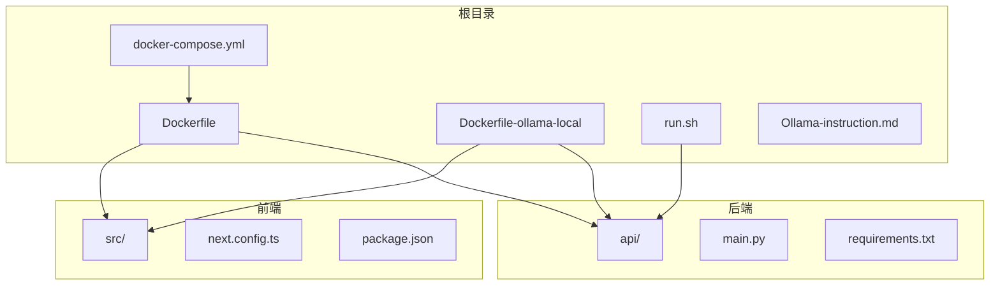
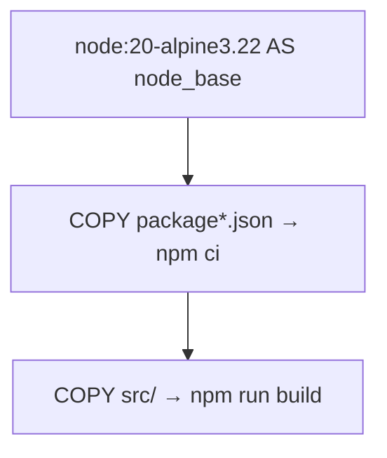
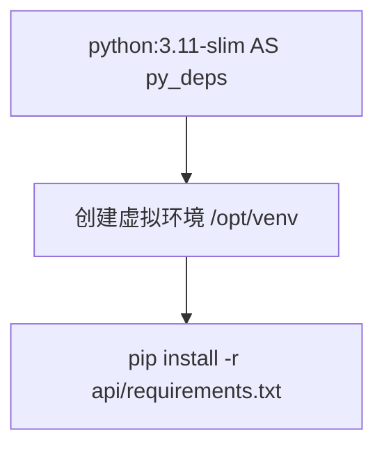
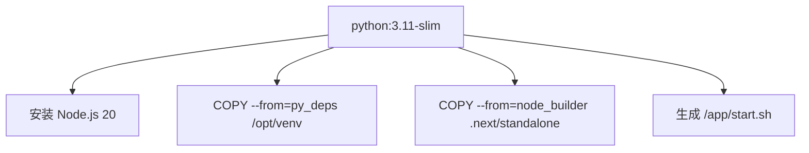
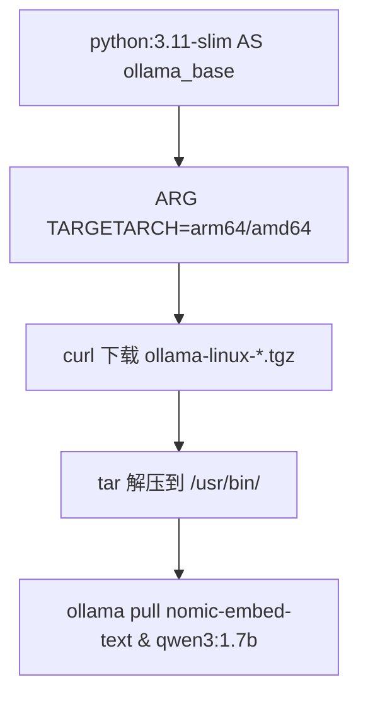
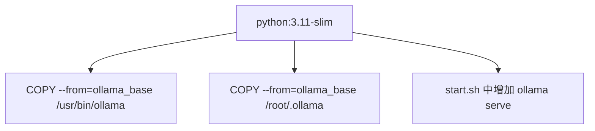
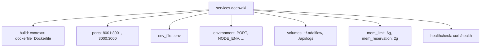
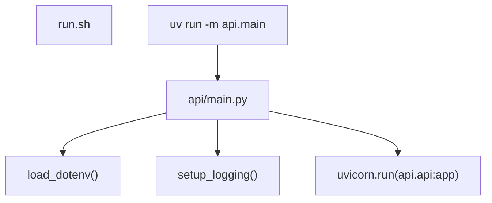
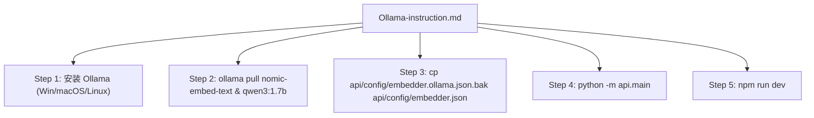
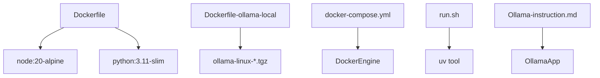

# 部署相关结构

<cite>
**本文档中引用的文件**  
- [Dockerfile](file://Dockerfile)
- [Dockerfile-ollama-local](file://Dockerfile-ollama-local)
- [docker-compose.yml](file://docker-compose.yml)
- [run.sh](file://run.sh)
- [Ollama-instruction.md](file://Ollama-instruction.md)
- [api/main.py](file://api/main.py)
</cite>

## 目录
1. [简介](#简介)
2. [项目结构](#项目结构)
3. [核心组件](#核心组件)
4. [架构概述](#架构概述)
5. [详细组件分析](#详细组件分析)
6. [依赖分析](#依赖分析)
7. [性能考虑](#性能考虑)
8. [故障排除指南](#故障排除指南)
9. [结论](#结论)

## 简介
本项目采用容器化部署方式，结合 Node.js 前端与 Python 后端，支持通过 Ollama 在本地运行 AI 模型。部署流程通过 `Dockerfile` 多阶段构建实现前后端分离打包，并通过 `docker-compose.yml` 进行服务编排。项目提供两种 Docker 构建方案：标准生产环境部署和本地 Ollama 部署，分别适用于云服务和本地私有化部署场景。

## 项目结构
项目采用前后端分离架构，前端基于 Next.js 构建于 `src` 目录，后端基于 FastAPI 实现于 `api` 目录。部署相关文件位于根目录，包括 `Dockerfile`、`docker-compose.yml`、启动脚本 `run.sh` 以及本地 Ollama 部署指南 `Ollama-instruction.md`。



**Diagram sources**
- [Dockerfile](file://Dockerfile)
- [Dockerfile-ollama-local](file://Dockerfile-ollama-local)
- [docker-compose.yml](file://docker-compose.yml)
- [run.sh](file://run.sh)
- [Ollama-instruction.md](file://Ollama-instruction.md)

**Section sources**
- [Dockerfile](file://Dockerfile)
- [Dockerfile-ollama-local](file://Dockerfile-ollama-local)
- [docker-compose.yml](file://docker-compose.yml)
- [run.sh](file://run.sh)
- [Ollama-instruction.md](file://Ollama-instruction.md)

## 核心组件
项目部署核心由 `Dockerfile` 多阶段构建、`docker-compose.yml` 服务编排、`run.sh` 启动脚本及 `Ollama-instruction.md` 部署指南构成。`Dockerfile` 实现前端构建与后端打包的分离，`docker-compose.yml` 定义服务端口、环境变量与持久化卷，`run.sh` 提供非容器化快速启动方式，`Ollama-instruction.md` 详细指导本地 AI 模型部署流程。

**Section sources**
- [Dockerfile](file://Dockerfile)
- [docker-compose.yml](file://docker-compose.yml)
- [run.sh](file://run.sh)
- [Ollama-instruction.md](file://Ollama-instruction.md)

## 架构概述
系统采用微服务式容器架构，前端 Next.js 应用与后端 FastAPI 服务运行于同一容器内，通过 `start.sh` 脚本并行启动。`docker-compose.yml` 将容器暴露两个端口：3000 用于前端访问，8001 用于后端 API。数据持久化通过挂载 `~/.adalflow` 目录实现缓存与日志保留。

```mermaid
graph TB
subgraph "宿主机"
Browser["浏览器 http://localhost:3000"]
ComposeFile["docker-compose.yml"]
LocalVolume["~/.adalflow"]
end
subgraph "Docker 容器"
Frontend["Next.js 前端"]
Backend["FastAPI 后端"]
StartScript["start.sh"]
LogsVolume["/app/api/logs"]
end
ComposeFile --> DockerEngine
Browser --> Frontend
StartScript --> Frontend
StartScript --> Backend
LocalVolume < --> LogsVolume
```

**Diagram sources**
- [docker-compose.yml](file://docker-compose.yml)
- [Dockerfile](file://Dockerfile)
- [run.sh](file://run.sh)

## 详细组件分析

### Dockerfile 多阶段构建分析
`Dockerfile` 采用多阶段构建策略，分别使用 Node.js 和 Python 基础镜像独立构建前端与后端。

#### 前端构建阶段


**Diagram sources**
- [Dockerfile](file://Dockerfile#L1-L30)

#### 后端依赖安装阶段


**Diagram sources**
- [Dockerfile](file://Dockerfile#L31-L37)

#### 最终镜像集成


**Diagram sources**
- [Dockerfile](file://Dockerfile#L38-L107)

### Dockerfile-ollama-local 对比分析
`Dockerfile-ollama-local` 在标准 `Dockerfile` 基础上增加了 Ollama 本地模型支持。

#### Ollama 集成阶段


**Diagram sources**
- [Dockerfile-ollama-local](file://Dockerfile-ollama-local#L38-L65)

#### 最终镜像差异


**Diagram sources**
- [Dockerfile-ollama-local](file://Dockerfile-ollama-local#L66-L116)

### docker-compose.yml 服务编排分析
`docker-compose.yml` 定义了 `deepwiki` 服务的完整运行时配置。



**Diagram sources**
- [docker-compose.yml](file://docker-compose.yml#L1-L29)

**Section sources**
- [docker-compose.yml](file://docker-compose.yml#L1-L29)

### run.sh 启动脚本分析
`run.sh` 提供非 Docker 环境下的快速启动方式，使用 `uv` 工具运行后端服务。



**Diagram sources**
- [run.sh](file://run.sh)
- [api/main.py](file://api/main.py#L1-L79)

**Section sources**
- [run.sh](file://run.sh)
- [api/main.py](file://api/main.py#L1-L79)

### Ollama-instruction.md 部署指南分析
`Ollama-instruction.md` 为用户提供完整的本地部署指导，涵盖安装、配置、启动全流程。



**Diagram sources**
- [Ollama-instruction.md](file://Ollama-instruction.md#L1-L189)

**Section sources**
- [Ollama-instruction.md](file://Ollama-instruction.md#L1-L189)

## 依赖分析
项目部署依赖关系清晰，前端依赖 Node.js 生态，后端依赖 Python 生态，容器化依赖 Docker 生态。



**Diagram sources**
- [Dockerfile](file://Dockerfile)
- [Dockerfile-ollama-local](file://Dockerfile-ollama-local)
- [docker-compose.yml](file://docker-compose.yml)
- [run.sh](file://run.sh)
- [Ollama-instruction.md](file://Ollama-instruction.md)

## 性能考虑
部署架构充分考虑性能需求。`docker-compose.yml` 设置 6GB 内存上限和 2GB 预留，确保大模型处理能力。`Dockerfile` 中设置 `NODE_OPTIONS="--max-old-space-size=4096"` 优化 Node.js 构建内存。本地 Ollama 部署建议 16GB+ 内存以获得最佳性能。

## 故障排除指南
常见部署问题及解决方案：
- **Ollama 连接失败**：确保 `ollama serve` 正在运行，检查 `OLLAMA_HOST` 环境变量
- **API 密钥警告**：若使用 Ollama 可忽略 `OPENAI_API_KEY` 和 `GOOGLE_API_KEY` 警告
- **构建失败**：检查网络连接，确保能访问 `deb.nodesource.com` 和 `ollama.com`
- **内存不足**：增加 `docker-compose.yml` 中 `mem_limit` 值，或使用更小模型如 `phi3:mini`

**Section sources**
- [Dockerfile](file://Dockerfile)
- [Dockerfile-ollama-local](file://Dockerfile-ollama-local)
- [Ollama-instruction.md](file://Ollama-instruction.md)

## 结论
本项目部署架构设计合理，通过 `Dockerfile` 多阶段构建实现高效镜像生成，`docker-compose.yml` 提供完整的生产级服务编排。`Dockerfile-ollama-local` 为本地 AI 模型部署提供便利，`Ollama-instruction.md` 详细指导用户完成私有化部署。整体方案兼顾生产环境稳定性和本地开发灵活性，为用户提供完整的容器化部署体验。