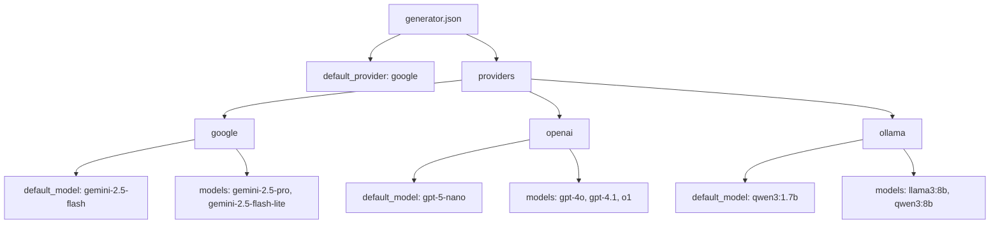
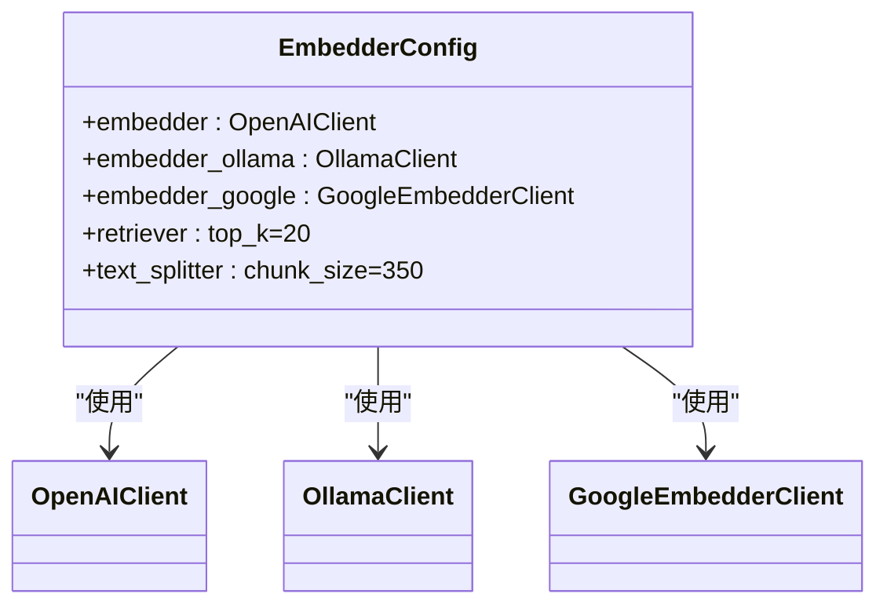
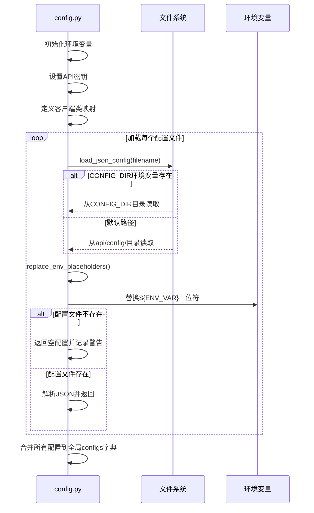
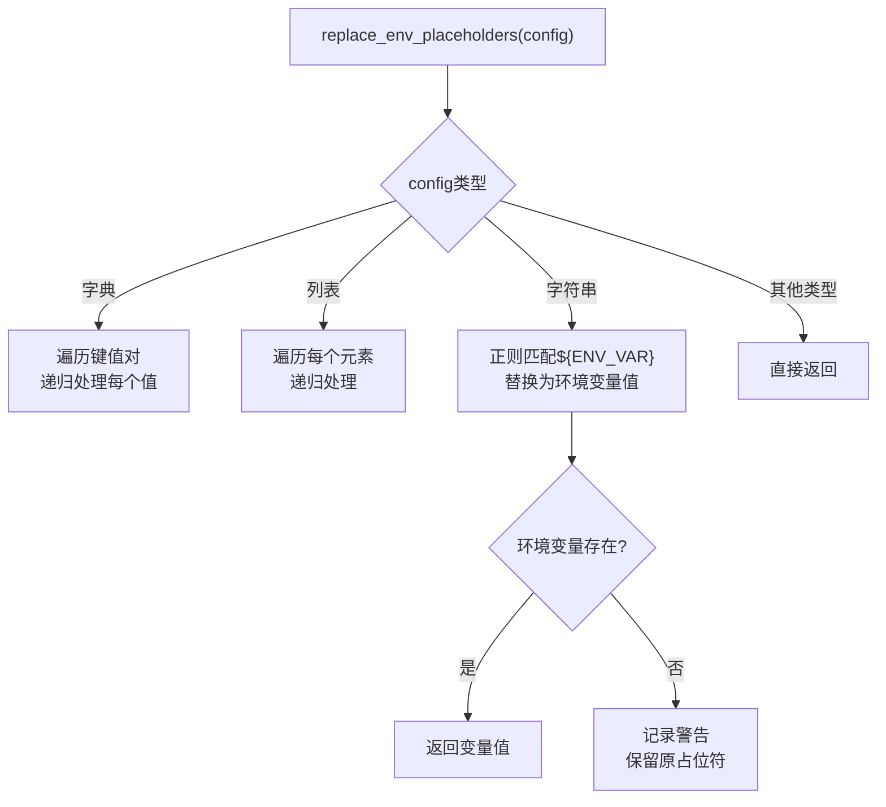
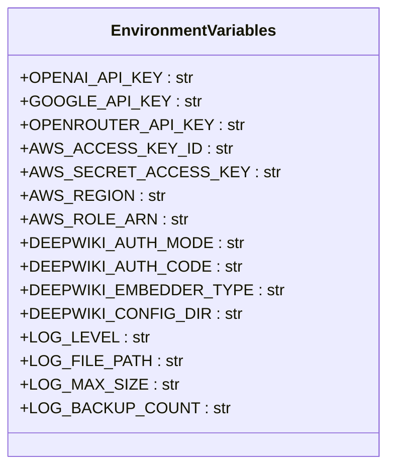

# 配置文件结构

<cite>
**本文档中引用的文件**  
- [generator.json](file://api/config/generator.json)
- [embedder.json](file://api/config/embedder.json)
- [lang.json](file://api/config/lang.json)
- [repo.json](file://api/config/repo.json)
- [config.py](file://api/config.py)
- [pyproject.toml](file://pyproject.toml)
- [package.json](file://package.json)
</cite>

## 目录
1. [项目配置体系概述](#项目配置体系概述)
2. [核心JSON配置文件详解](#核心json配置文件详解)
3. [配置加载与验证机制](#配置加载与验证机制)
4. [依赖管理配置](#依赖管理配置)
5. [环境变量安全配置](#环境变量安全配置)

## 项目配置体系概述

本项目采用模块化配置体系，将不同功能的配置分离到独立的JSON文件中，并通过`config.py`统一加载和管理。配置体系分为模型生成、嵌入模型、多语言支持、代码库分析四大核心模块，同时通过环境变量实现敏感信息的安全注入和运行时配置覆盖。

**Section sources**
- [config.py](file://api/config.py#L1-L50)

## 核心JSON配置文件详解

### 生成模型配置 (generator.json)

`generator.json`定义了LLM生成模型的参数，包括默认提供商、支持的模型列表及其生成参数（如temperature、top_p等）。每个提供商（如google、openai、ollama）可配置默认模型和特定模型参数。



**Diagram sources**
- [generator.json](file://api/config/generator.json#L1-L200)
- [config.py](file://api/config.py#L120-L144)

### 嵌入模型配置 (embedder.json)

`embedder.json`配置了嵌入模型选项，支持多种嵌入客户端（OpenAI、Ollama、Google）。配置包括批处理大小、模型参数（如dimensions、task_type）以及检索器和文本分割器的参数。



**Diagram sources**
- [embedder.json](file://api/config/embedder.json#L1-L34)
- [config.py](file://api/config.py#L147-L157)

### 多语言标签配置 (lang.json)

`lang.json`管理多语言标签，定义了支持的语言列表（包括语言代码和显示名称）及默认语言。该配置用于前端国际化支持。

```mermaid
erDiagram
LANG_CONFIG {
string default PK
object supported_languages FK
}
SUPPORTED_LANGUAGES {
string en "English"
string zh "中文"
string ja "日本語"
string es "Español"
string fr "Français"
string kr "한국어"
string vi "Tiếng Việt"
string "pt-br" "Português Brasileiro"
string "zh-tw" "繁體中文"
string ru "Русский"
}
LANG_CONFIG ||--|| SUPPORTED_LANGUAGES : "包含"
```

**Diagram sources**
- [lang.json](file://api/config/lang.json#L1-L16)
- [config.py](file://api/config.py#L233-L259)

### 代码库分析规则 (repo.json)

`repo.json`设置代码库分析规则，包括排除的目录和文件模式，以及代码库最大大小限制（50000MB）。

```mermaid
flowchart TD
A["repo.json"] --> B["file_filters"]
B --> C["excluded_dirs"]
C --> D["./.git/", "./node_modules/", "./.venv/"]
B --> E["excluded_files"]
E --> F[".lock", ".env.*", "*.pyc", "yarn.lock"]
A --> G["repository"]
G --> H["max_size_mb: 50000"]
```

**Diagram sources**
- [repo.json](file://api/config/repo.json#L1-L129)
- [config.py](file://api/config.py#L229-L230)

## 配置加载与验证机制

`config.py`实现了统一的配置加载与验证机制，通过`load_json_config()`函数加载所有JSON配置文件，并在加载过程中替换环境变量占位符。

### 配置加载流程



**Diagram sources**
- [config.py](file://api/config.py#L96-L117)
- [config.py](file://api/config.py#L65-L93)

### 环境变量占位符处理

`replace_env_placeholders()`函数递归处理配置中的环境变量占位符，支持嵌套结构中的字符串替换。



**Section sources**
- [config.py](file://api/config.py#L65-L93)

## 依赖管理配置

### Python依赖管理 (pyproject.toml)

`pyproject.toml`定义了Python项目的依赖关系，使用现代Python打包标准，包含项目元数据和依赖列表。

```toml
[project]
name = "deepwiki-open"
version = "0.1.0"
dependencies = [
  "fastapi>=0.95.0",
  "uvicorn>=0.21.1",
  "pydantic>=2.0.0",
  "google-generativeai>=0.3.0",
  "adalflow>=0.1.0",
  "faiss-cpu>=1.7.4"
]
```

**Section sources**
- [pyproject.toml](file://pyproject.toml#L1-L28)

### JavaScript依赖管理 (package.json)

`package.json`管理前端JavaScript依赖，采用Yarn包管理器，定义了Next.js应用的依赖和开发依赖。

```json
{
  "name": "deepwiki-open",
  "version": "0.1.0",
  "dependencies": {
    "next": "15.3.1",
    "react": "^19.0.0",
    "next-intl": "^4.1.0",
    "mermaid": "^11.4.1"
  },
  "devDependencies": {
    "eslint": "^9",
    "typescript": "^5",
    "tailwindcss": "^4"
  },
  "packageManager": "yarn@1.22.22"
}
```

**Section sources**
- [package.json](file://package.json#L1-L39)

## 环境变量安全配置

系统通过环境变量实现敏感配置的安全管理，避免密钥硬编码。

### 核心环境变量



**Diagram sources**
- [config.py](file://api/config.py#L10-L51)
- [logging_config.py](file://api/logging_config.py#L34-L69)

### 安全配置实践

1. **API密钥注入**：所有API密钥通过环境变量注入，并自动设置到`os.environ`
2. **配置目录覆盖**：通过`DEEPWIKI_CONFIG_DIR`环境变量可自定义配置文件路径
3. **日志安全**：`LOG_FILE_PATH`有路径校验，防止路径遍历攻击
4. **嵌入器类型切换**：通过`DEEPWIKI_EMBEDDER_TYPE`环境变量动态切换嵌入模型

**Section sources**
- [config.py](file://api/config.py#L10-L51)
- [config.py](file://api/config.py#L43-L48)
- [logging_config.py](file://api/logging_config.py#L34-L69)