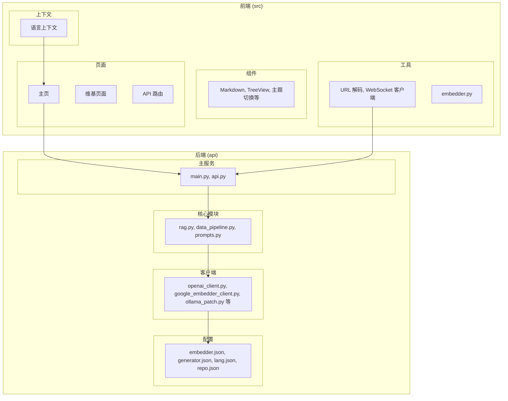
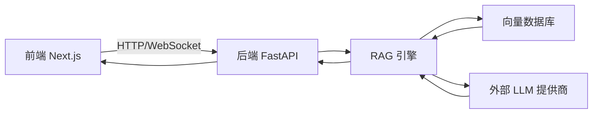
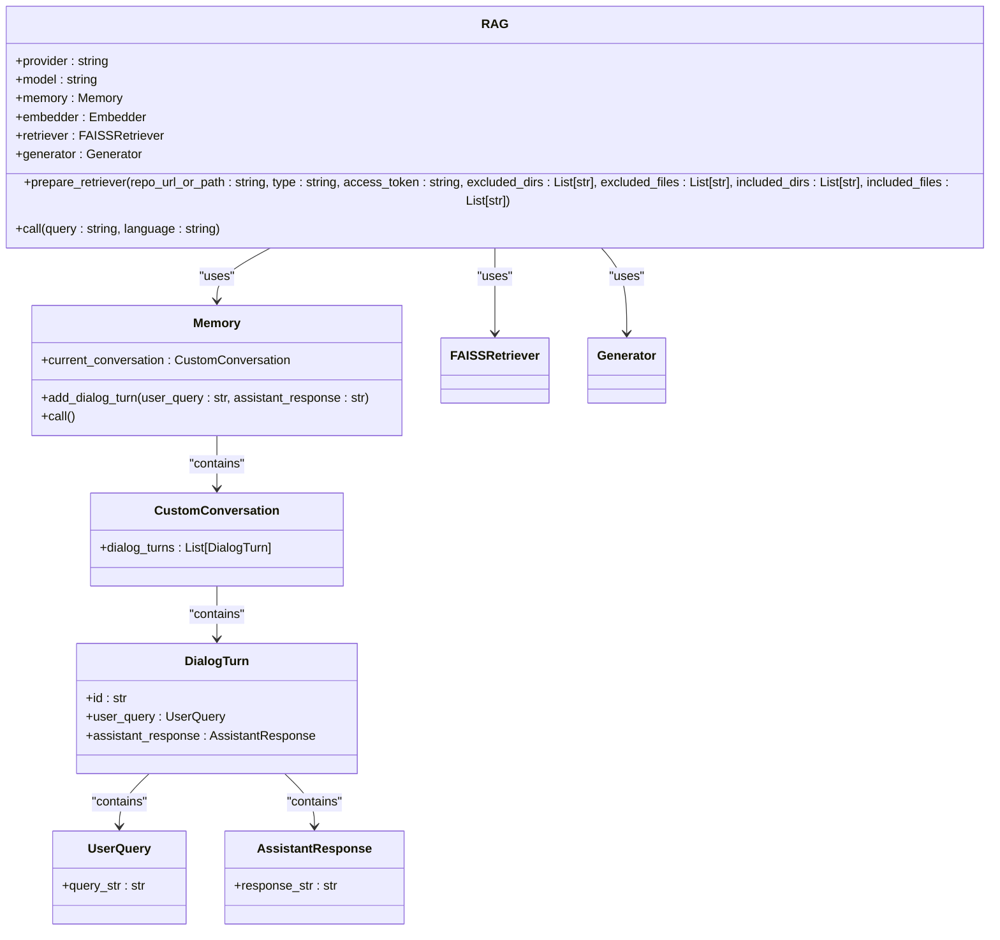
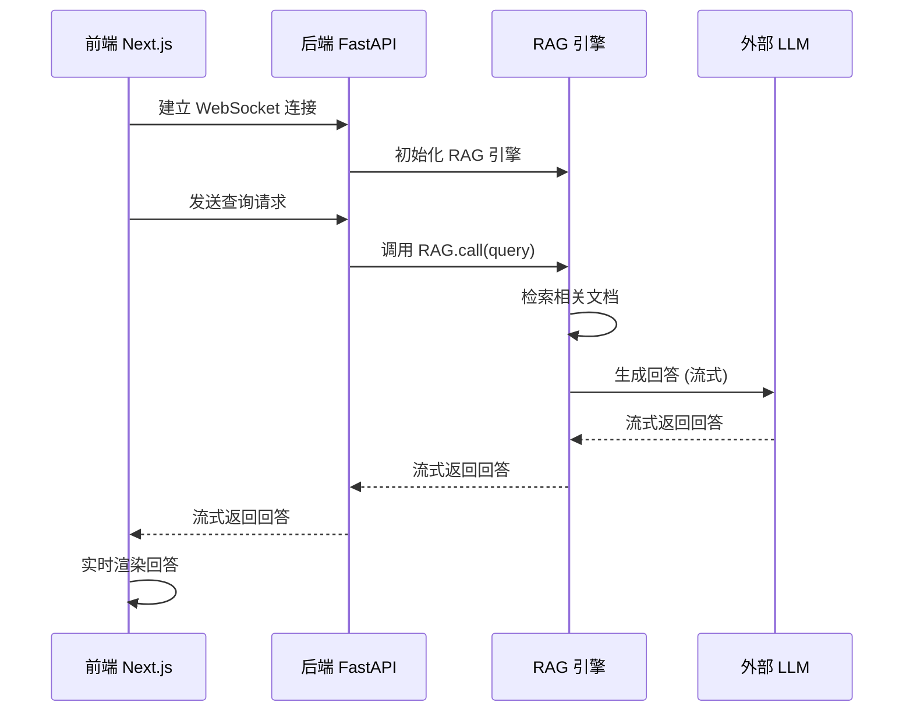
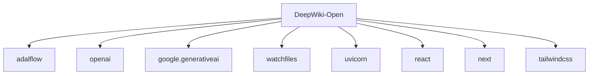

# 系统概述

<cite>
**本文档中引用的文件**  
- [main.py](file://api/main.py)
- [page.tsx](file://src/app/page.tsx)
- [rag.py](file://api/rag.py)
- [openai_client.py](file://api/openai_client.py)
- [route.ts](file://src/app/api/chat/stream/route.ts)
</cite>

## 目录
1. [简介](#简介)
2. [项目结构](#项目结构)
3. [核心功能](#核心功能)
4. [架构概览](#架构概览)
5. [详细组件分析](#详细组件分析)
6. [依赖分析](#依赖分析)
7. [性能考虑](#性能考虑)
8. [故障排除指南](#故障排除指南)
9. [结论](#结论)

## 简介
DeepWiki-Open 是一个基于人工智能的代码库文档生成系统，旨在通过智能维基生成、多语言支持、多模型集成（如 Google Gemini、OpenAI、Ollama 等）、交互式聊天与 RAG（检索增强生成）引擎，为开发者提供全面的代码理解与文档化解决方案。系统采用前后端分离的全栈架构，前端使用 Next.js，后端采用 FastAPI，并通过流式 API 和 WebSocket 实现实时响应。本文档将从开发者和终端用户视角，深入解析其核心功能与架构设计。

## 项目结构
DeepWiki-Open 项目采用模块化设计，主要分为 `api` 和 `src` 两大目录。`api` 目录包含后端服务逻辑，包括配置、工具、客户端集成、数据管道、RAG 引擎等。`src` 目录包含前端应用，使用 Next.js 构建，包含页面、组件、上下文、钩子、消息、类型、工具和国际化配置。

**图源**
- [main.py](file://api/main.py)
- [page.tsx](file://src/app/page.tsx)

**本节来源**
- [main.py](file://api/main.py)
- [page.tsx](file://src/app/page.tsx)

## 核心功能
DeepWiki-Open 的核心功能包括智能维基生成、多语言支持、多模型集成、交互式聊天与 RAG 引擎。系统能够解析 GitHub、GitLab、BitBucket 等代码仓库，或本地文件夹，生成包含架构图、组件关系、数据流和流程工作流的智能维基。前端通过配置模态框允许用户选择语言、模型提供商、模型、文件过滤规则等。后端通过 RAG 引擎结合向量数据库和外部 LLM 提供商，实现精准的代码理解与问答。

**本节来源**
- [page.tsx](file://src/app/page.tsx)
- [rag.py](file://api/rag.py)

## 架构概览
DeepWiki-Open 采用前后端分离架构。前端使用 Next.js 构建用户界面，通过 API 路由与后端通信。后端使用 FastAPI 提供 RESTful API 和 WebSocket 服务。系统通过流式 API 和 WebSocket 实现实时响应。RAG 引擎负责从代码库中提取信息，生成向量嵌入并存储在本地数据库中，当用户提问时，通过检索增强生成技术，结合外部 LLM 提供商（如 OpenAI、Google Gemini 等）生成回答。

**图源**
- [main.py](file://api/main.py)
- [rag.py](file://api/rag.py)

## 详细组件分析

### RAG 引擎分析
RAG 引擎是 DeepWiki-Open 的核心组件，负责实现检索增强生成。它通过 `prepare_retriever` 方法准备检索器，加载代码库数据，生成向量嵌入，并创建 FAISS 检索器。`call` 方法处理用户查询，通过检索器获取相关文档，并结合 LLM 生成回答。

**图源**
- [rag.py](file://api/rag.py#L152-L444)

**本节来源**
- [rag.py](file://api/rag.py)

### 交互式聊天分析
交互式聊天功能通过 WebSocket 和 HTTP 流式 API 实现实时响应。前端通过 `websocketClient.ts` 建立 WebSocket 连接，发送查询请求，并接收流式响应。后端通过 `/chat/completions/stream` 接口处理流式请求，使用 `OpenAIClient` 或其他 LLM 客户端生成响应，并通过流式传输返回给前端。

**图源**
- [route.ts](file://src/app/api/chat/stream/route.ts)
- [rag.py](file://api/rag.py)

**本节来源**
- [route.ts](file://src/app/api/chat/stream/route.ts)
- [rag.py](file://api/rag.py)

## 依赖分析
DeepWiki-Open 依赖多个外部库和 API，包括 `adalflow` 用于 AI 组件、`openai` 用于 OpenAI API 集成、`google.generativeai` 用于 Google Gemini 集成、`watchfiles` 用于文件监控、`uvicorn` 用于 FastAPI 服务器。项目通过 `pyproject.toml` 和 `requirements.txt` 管理 Python 依赖，通过 `package.json` 管理 JavaScript 依赖。

**图源**
- [pyproject.toml](file://pyproject.toml)
- [requirements.txt](file://api/requirements.txt)
- [package.json](file://package.json)

**本节来源**
- [pyproject.toml](file://pyproject.toml)
- [requirements.txt](file://api/requirements.txt)
- [package.json](file://package.json)

## 性能考虑
系统通过流式 API 和 WebSocket 实现实时响应，减少用户等待时间。RAG 引擎通过本地向量数据库缓存代码库的向量嵌入，提高检索效率。系统支持多种模型提供商和模型，用户可根据性能和成本需求进行选择。Ollama 模型支持本地运行，减少对外部 API 的依赖，提高响应速度和数据隐私。

## 故障排除指南
常见问题包括环境变量未配置、Ollama 模型未安装、WebSocket 连接失败等。确保 `GOOGLE_API_KEY` 和 `OPENAI_API_KEY` 环境变量已正确设置。对于 Ollama 模型，确保已运行 `ollama pull <model_name>` 安装所需模型。WebSocket 连接失败时，系统会自动降级到 HTTP 流式 API。

**本节来源**
- [main.py](file://api/main.py)
- [rag.py](file://api/rag.py)
- [route.ts](file://src/app/api/chat/stream/route.ts)

## 结论
DeepWiki-Open 是一个功能强大、架构清晰的 AI 驱动代码库文档生成系统。它通过智能维基生成、多语言支持、多模型集成和交互式聊天，为开发者提供了高效的代码理解与文档化工具。系统采用前后端分离架构，通过流式 API 和 WebSocket 实现实时响应，结合 RAG 引擎和外部 LLM 提供商，实现精准的代码问答。未来可进一步优化向量数据库性能，支持更多代码托管平台和 LLM 提供商。