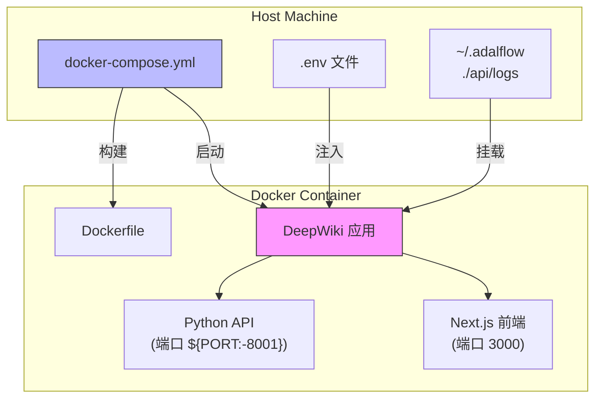
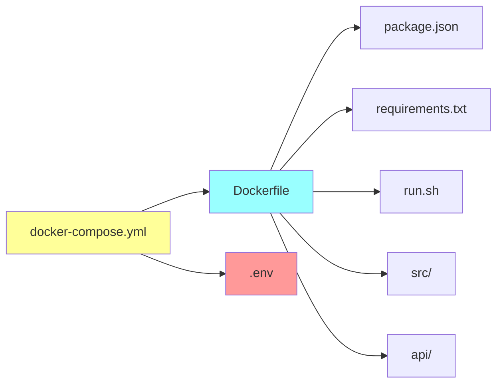

# Docker Compose编排

<cite>
**Referenced Files in This Document**   
- [docker-compose.yml](file://docker-compose.yml)
- [Dockerfile](file://Dockerfile)
- [run.sh](file://run.sh)
</cite>

## 目录
1. [简介](#简介)
2. [项目结构](#项目结构)
3. [核心组件](#核心组件)
4. [架构概述](#架构概述)
5. [详细组件分析](#详细组件分析)
6. [依赖分析](#依赖分析)
7. [性能考量](#性能考量)
8. [故障排除指南](#故障排除指南)
9. [结论](#结论)

## 简介
本文档深入解析DeepWiki项目的Docker Compose编排配置，详细说明服务构建、端口映射、环境变量注入、数据持久化、健康检查及资源限制等关键配置。通过分析`docker-compose.yml`、`Dockerfile`和相关脚本，全面阐述系统容器化部署的实现机制。

## 项目结构
DeepWiki项目采用前后端分离架构，包含Next.js前端、Python后端API、Docker容器化配置及测试套件。主要目录包括：
- `src/`: Next.js前端应用
- `api/`: Python后端API服务
- 根目录: 包含Docker配置文件、构建脚本和项目依赖

**Section sources**
- [docker-compose.yml](file://docker-compose.yml#L1-L30)

## 核心组件

`deepwiki`服务是系统的核心容器，通过Docker Compose进行编排。该服务基于Dockerfile构建镜像，集成Next.js前端和Python后端，并通过环境变量、卷挂载和资源限制实现生产级部署配置。

**Section sources**
- [docker-compose.yml](file://docker-compose.yml#L1-L30)
- [Dockerfile](file://Dockerfile#L1-L108)

## 架构概述



**Diagram sources**
- [docker-compose.yml](file://docker-compose.yml#L1-L30)
- [Dockerfile](file://Dockerfile#L1-L108)

## 详细组件分析

### 服务构建与端口映射分析

`deepwiki`服务通过`build`指令基于项目根目录的`Dockerfile`构建镜像。端口映射配置实现了API和前端服务的网络访问：

- **API端口**: `${PORT:-8001}:${PORT:-8001}` 将容器内的API服务端口映射到主机，使用环境变量`PORT`或默认值8001
- **前端端口**: `3000:3000` 将Next.js应用的开发服务器端口固定映射

这种配置允许通过不同端口访问API后端和Web前端，实现服务解耦。

**Section sources**
- [docker-compose.yml](file://docker-compose.yml#L4-L9)

### 环境变量注入机制

环境变量通过两种方式注入容器：

1. **env_file**: 从`.env`文件加载环境变量，提供安全的密钥管理
2. **environment**: 直接在compose文件中定义变量，支持默认值语法`${VAR:-default}`

关键环境变量包括：
- `PORT`: 服务监听端口，默认8001
- `NODE_ENV`: 运行环境，设为production
- `SERVER_BASE_URL`: 服务器基础URL，用于API调用
- `LOG_LEVEL`: 日志级别，默认INFO
- `LOG_FILE_PATH`: 日志文件路径，默认`api/logs/application.log`

这些变量在运行时被`start.sh`脚本读取并传递给应用程序。

**Section sources**
- [docker-compose.yml](file://docker-compose.yml#L10-L17)
- [Dockerfile](file://Dockerfile#L100-L107)

### 数据持久化策略

通过`volumes`配置实现数据持久化：

- `~/.adalflow:/root/.adalflow`: 挂载用户主目录的`.adalflow`文件夹，保留向量缓存和仓库数据
- `./api/logs:/app/api/logs`: 挂载本地日志目录，确保容器重启后日志不丢失

这种策略确保了应用状态和日志数据的持久性，避免容器重建时数据丢失。

**Section sources**
- [docker-compose.yml](file://docker-compose.yml#L18-L21)

### 健康检查机制

健康检查配置监控服务可用性：

```mermaid
flowchart TD
Start["健康检查开始"] --> Test["执行: curl -f http://localhost:${PORT:-8001}/health"]
Test --> Success{"HTTP 200?}
Success --> |是| Healthy["容器健康"]
Success --> |否| Retry["重试计数+1"]
Retry --> Retries{"重试<3次?"}
Retries --> |是| Wait["等待60秒"]
Wait --> Test
Retries --> |否| Unhealthy["容器不健康"]
style Healthy fill:#9f9
style Unhealthy fill:#f99
```

**Diagram sources**
- [docker-compose.yml](file://docker-compose.yml#L23-L28)

健康检查参数：
- **test**: 使用curl检测`/health`端点
- **interval**: 检查间隔60秒
- **timeout**: 超时时间10秒
- **retries**: 连续失败3次后标记为不健康
- **start_period**: 启动后30秒开始检查

**Section sources**
- [docker-compose.yml](file://docker-compose.yml#L23-L28)

### 资源限制分析

资源限制配置确保系统稳定性：

- `mem_limit: 6g`: 内存硬限制，容器最多使用6GB内存
- `mem_reservation: 2g`: 内存软限制，保证容器至少有2GB内存可用

这些限制防止容器过度消耗主机资源，提高多容器环境下的系统稳定性。

**Section sources**
- [docker-compose.yml](file://docker-compose.yml#L22-L23)

## 依赖分析



**Diagram sources**
- [docker-compose.yml](file://docker-compose.yml#L1-L30)
- [Dockerfile](file://Dockerfile#L1-L108)

## 性能考量

资源配置和构建策略对性能有重要影响：

- **分阶段构建**: Dockerfile采用多阶段构建，减小最终镜像体积
- **内存优化**: 设置`NODE_OPTIONS="--max-old-space-size=4096"`优化Node.js内存使用
- **资源预留**: `mem_reservation`确保关键服务有足够的内存资源
- **并行服务**: API和前端服务并行运行，提高响应效率

**Section sources**
- [Dockerfile](file://Dockerfile#L99-L100)

## 故障排除指南

常见问题及解决方案：

1. **端口冲突**: 确保`PORT`环境变量指定的端口未被占用
2. **API密钥缺失**: 在`.env`文件中提供`OPENAI_API_KEY`和`GOOGLE_API_KEY`
3. **健康检查失败**: 检查`/health`端点是否正常响应
4. **内存不足**: 调整`mem_limit`值或优化应用内存使用
5. **构建失败**: 确保`package.json`和`requirements.txt`依赖正确

**Section sources**
- [Dockerfile](file://Dockerfile#L102-L105)
- [docker-compose.yml](file://docker-compose.yml#L23-L28)

## 结论

DeepWiki的Docker Compose配置提供了完整的生产级部署方案。通过合理的服务编排、环境变量管理、数据持久化和资源限制，实现了应用的可移植性、稳定性和可维护性。结合`.env`文件的配置覆盖机制，该方案既保证了默认配置的便捷性，又提供了足够的灵活性以适应不同部署环境的需求。