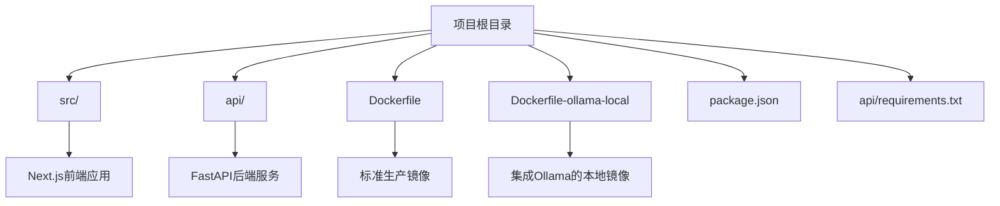
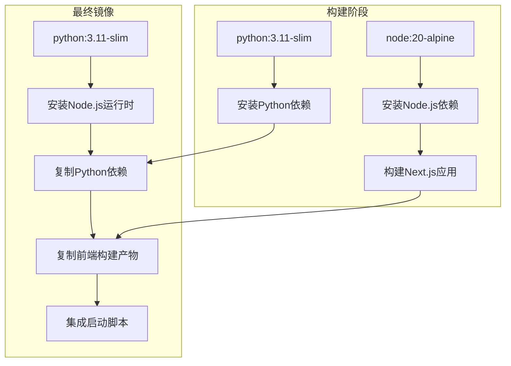
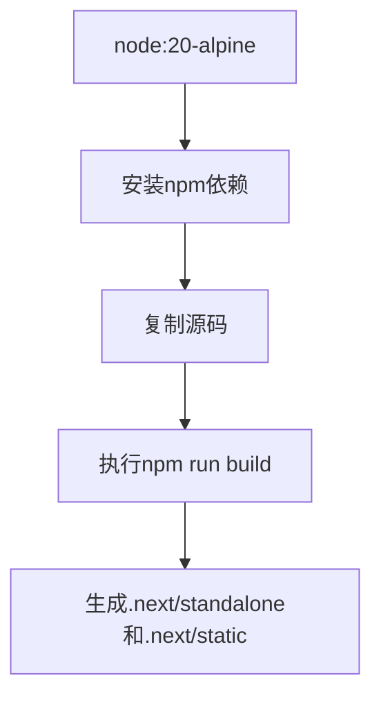
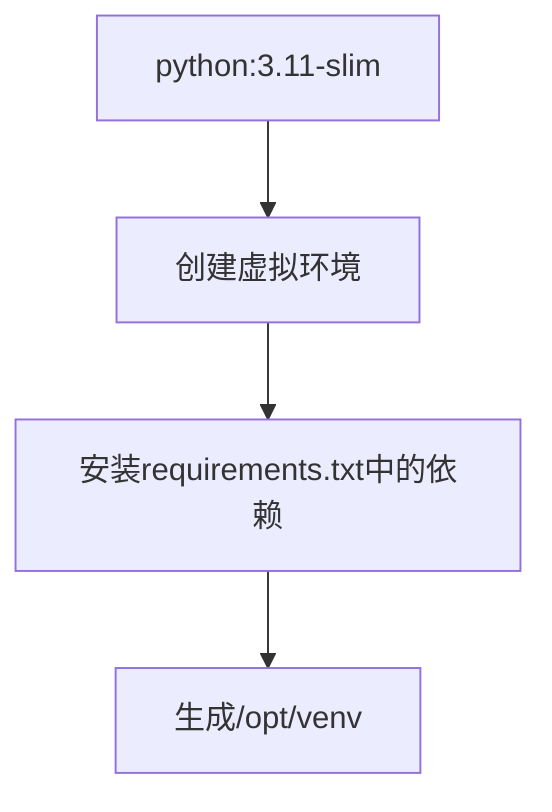
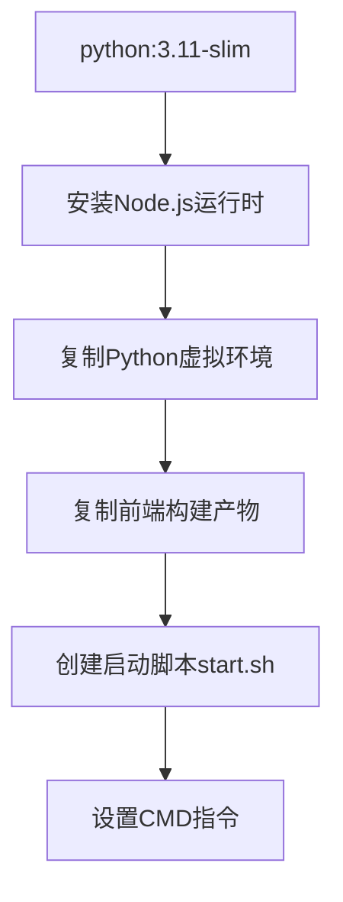
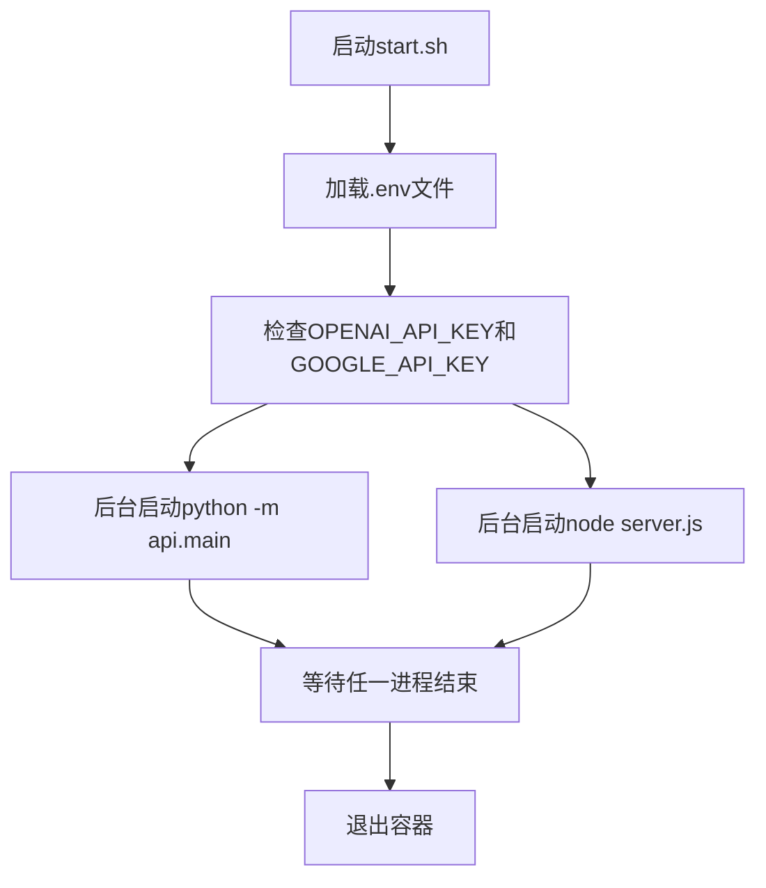
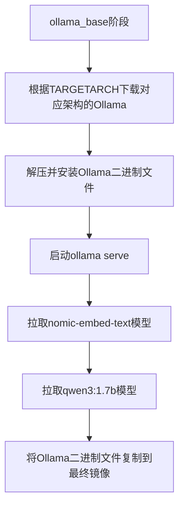
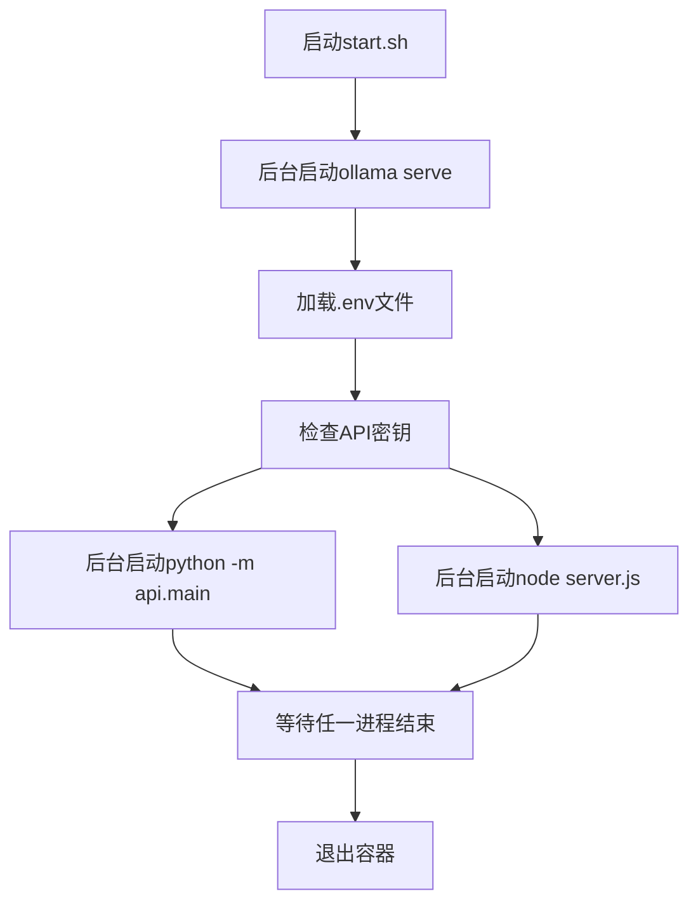
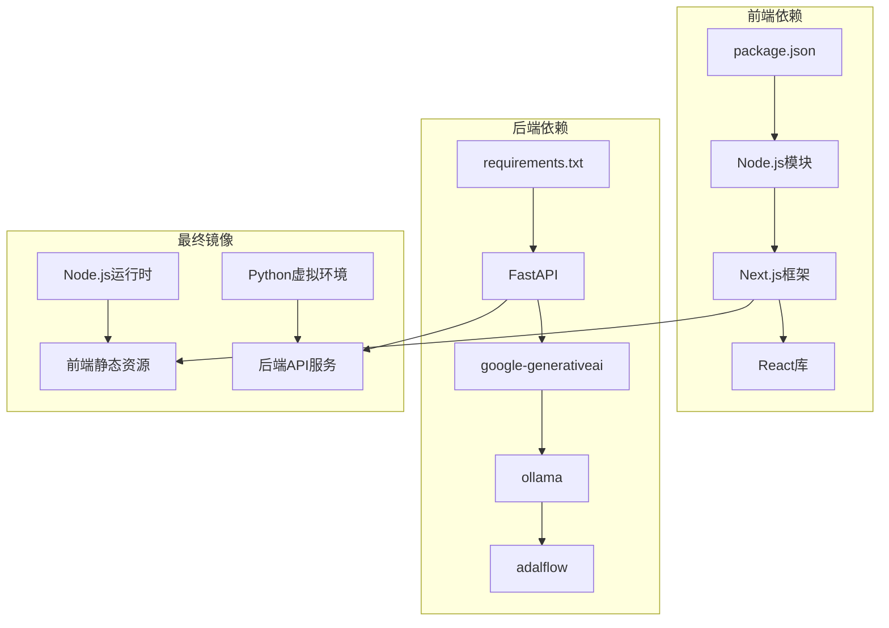

# Docker镜像构建

<cite>
**本文档中引用的文件**   
- [Dockerfile](file://Dockerfile)
- [Dockerfile-ollama-local](file://Dockerfile-ollama-local)
- [run.sh](file://run.sh)
- [api/main.py](file://api/main.py)
- [api/requirements.txt](file://api/requirements.txt)
- [package.json](file://package.json)
</cite>

## 目录
1. [简介](#简介)
2. [项目结构](#项目结构)
3. [核心组件](#核心组件)
4. [架构概述](#架构概述)
5. [详细组件分析](#详细组件分析)
6. [依赖分析](#依赖分析)
7. [性能考虑](#性能考虑)
8. [故障排除指南](#故障排除指南)
9. [结论](#结论)

## 简介
本文档详细分析了DeepWiki项目中Docker镜像的构建过程，重点解析了如何通过多阶段构建流程分别构建前端Next.js应用和后端FastAPI服务的生产镜像。文档将深入探讨Dockerfile的结构设计、多阶段构建策略、前后端集成方式以及启动脚本的实现机制。同时，对比了标准Dockerfile与Dockerfile-ollama-local在功能上的差异，特别是后者如何在构建时自动集成Ollama本地AI服务。通过本指南，开发者可以全面理解DeepWiki的容器化部署方案，并掌握针对不同硬件架构的构建方法。

## 项目结构
DeepWiki项目采用前后端分离的架构设计，前端基于Next.js框架构建，后端采用Python FastAPI实现。项目根目录下包含`src/`目录存放前端源码，`api/`目录存放后端API代码，以及两个Dockerfile文件用于不同场景的镜像构建。

**Diagram sources**
- [Dockerfile](file://Dockerfile)
- [Dockerfile-ollama-local](file://Dockerfile-ollama-local)

**Section sources**
- [Dockerfile](file://Dockerfile)
- [Dockerfile-ollama-local](file://Dockerfile-ollama-local)

## 核心组件
DeepWiki的核心组件包括基于Next.js的前端用户界面和基于FastAPI的后端API服务。前端负责提供交互式界面和可视化功能，后端负责处理业务逻辑、与AI模型交互以及管理数据流。两个Dockerfile文件定义了不同的构建策略：标准Dockerfile用于生产环境部署，而Dockerfile-ollama-local则专为本地开发和离线推理设计，集成了Ollama AI服务。

**Section sources**
- [Dockerfile](file://Dockerfile)
- [Dockerfile-ollama-local](file://Dockerfile-ollama-local)
- [api/main.py](file://api/main.py)

## 架构概述
DeepWiki的Docker构建架构采用多阶段构建（multi-stage build）策略，有效分离了构建环境和运行环境，显著减小了最终镜像的体积。构建过程分为四个主要阶段：Node.js依赖安装、前端构建、Python依赖安装和最终镜像组装。这种设计确保了构建过程中所需的开发工具和依赖不会被包含在最终的运行时镜像中。

**Diagram sources**
- [Dockerfile](file://Dockerfile#L1-L107)

## 详细组件分析

### 多阶段构建流程分析
DeepWiki的Docker构建流程通过多阶段构建实现了高效的镜像优化。整个流程始于两个独立的基础镜像：`node:20-alpine`用于前端构建，`python:3.11-slim`用于后端依赖管理。

#### 前端构建阶段

**Diagram sources**
- [Dockerfile](file://Dockerfile#L10-L28)
- [package.json](file://package.json)

#### 后端依赖安装阶段

**Diagram sources**
- [Dockerfile](file://Dockerfile#L30-L36)
- [api/requirements.txt](file://api/requirements.txt)

#### 最终镜像组装阶段

**Diagram sources**
- [Dockerfile](file://Dockerfile#L38-L107)
- [run.sh](file://run.sh)

**Section sources**
- [Dockerfile](file://Dockerfile#L1-L107)

### 启动脚本机制分析
启动脚本`start.sh`是DeepWiki容器运行的核心，负责并行启动前后端服务。该脚本首先加载环境变量，检查关键API密钥的配置状态，然后以后台进程方式同时启动FastAPI后端和Next.js服务。

**Diagram sources**
- [Dockerfile](file://Dockerfile#L88-L97)
- [api/main.py](file://api/main.py)

**Section sources**
- [Dockerfile](file://Dockerfile#L80-L107)
- [api/main.py](file://api/main.py)

### Dockerfile-ollama-local特殊构建分析
`Dockerfile-ollama-local`在标准构建流程的基础上增加了Ollama服务的集成，使其能够在容器内运行本地AI模型。

#### Ollama集成流程

**Diagram sources**
- [Dockerfile-ollama-local](file://Dockerfile-ollama-local#L40-L70)

#### 启动脚本差异分析
与标准Dockerfile相比，`Dockerfile-ollama-local`的启动脚本首先启动Ollama服务，然后再启动应用服务，确保AI模型服务的可用性。

**Diagram sources**
- [Dockerfile-ollama-local](file://Dockerfile-ollama-local#L100-L108)

**Section sources**
- [Dockerfile-ollama-local](file://Dockerfile-ollama-local#L1-L116)

## 依赖分析
DeepWiki项目的依赖管理通过Docker多阶段构建得到了有效优化。前端依赖通过`package.json`和`package-lock.json`管理，后端依赖通过`api/requirements.txt`管理。构建过程中，各阶段的依赖被隔离处理，最终镜像仅包含运行时必需的依赖。

**Diagram sources**
- [package.json](file://package.json)
- [api/requirements.txt](file://api/requirements.txt)

**Section sources**
- [package.json](file://package.json)
- [api/requirements.txt](file://api/requirements.txt)

## 性能考虑
DeepWiki的Docker构建策略充分考虑了性能和资源利用效率。通过使用轻量级基础镜像（alpine和slim），显著减小了镜像体积。多阶段构建避免了将构建工具和开发依赖包含在最终镜像中，提高了容器启动速度和安全性。同时，启动脚本中的并行服务启动机制确保了应用的快速响应。

## 故障排除指南
在构建和运行DeepWiki Docker镜像时可能遇到的常见问题及解决方案：

1. **API密钥警告**：启动时若未设置`OPENAI_API_KEY`或`GOOGLE_API_KEY`，容器会发出警告。解决方案是通过环境变量或挂载`.env`文件提供这些密钥。
2. **架构不匹配**：使用`Dockerfile-ollama-local`时，若`TARGETARCH`参数设置错误，会导致Ollama下载失败。应根据目标硬件正确设置`arm64`或`amd64`。
3. **证书问题**：若需要自定义CA证书，可通过构建参数`CUSTOM_CERT_DIR`指定证书目录，镜像构建时会自动更新证书。
4. **端口冲突**：默认使用8001端口（后端）和3000端口（前端），若发生冲突，可通过环境变量`PORT`进行修改。

**Section sources**
- [Dockerfile](file://Dockerfile#L80-L97)
- [Dockerfile-ollama-local](file://Dockerfile-ollama-local#L100-L108)

## 结论
DeepWiki的Docker构建方案展示了现代化Web应用容器化的最佳实践。通过多阶段构建，项目实现了构建环境与运行环境的完全分离，确保了最终镜像的安全性和轻量化。标准Dockerfile与`Dockerfile-ollama-local`的设计体现了灵活性和可扩展性，既能满足生产环境的部署需求，又能支持本地AI模型的集成。启动脚本的精心设计确保了前后端服务的协调运行。开发者可以根据具体需求选择合适的构建方案，并通过简单的构建命令为不同硬件架构生成优化的镜像。