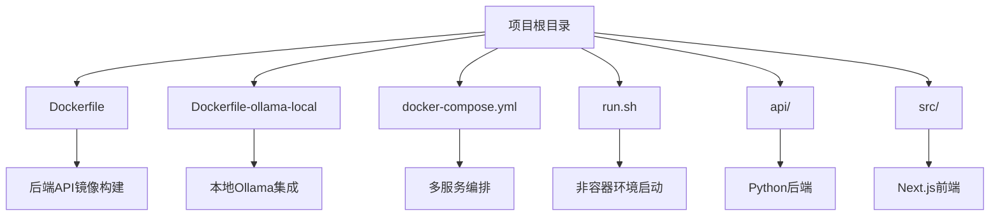
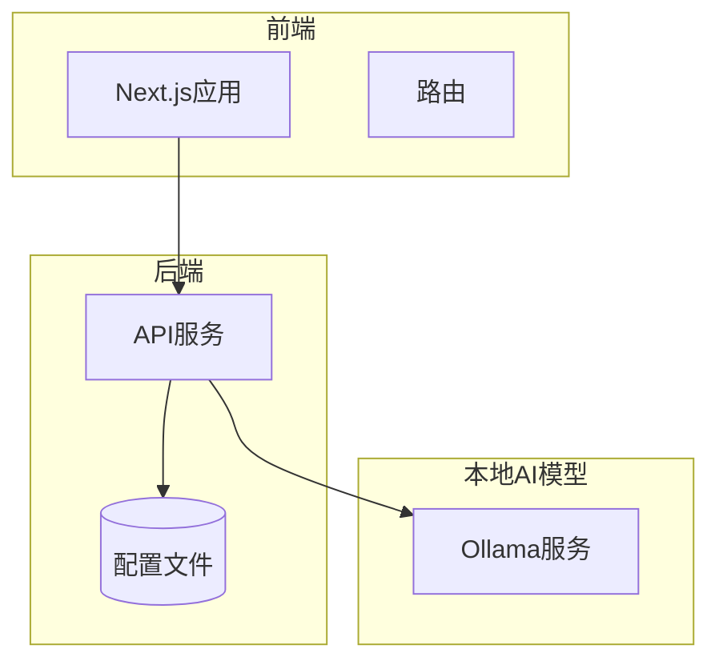
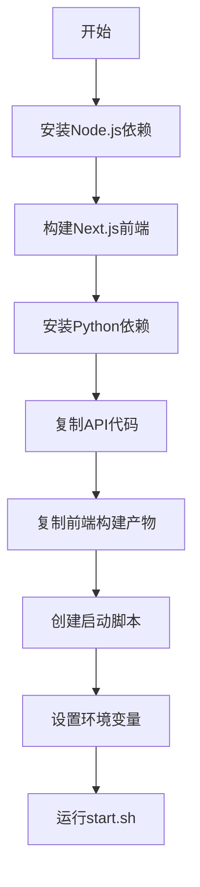
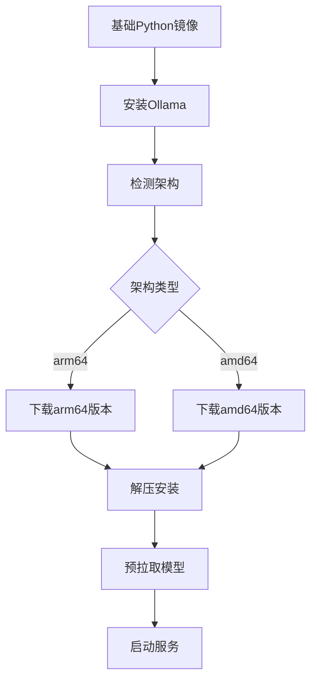
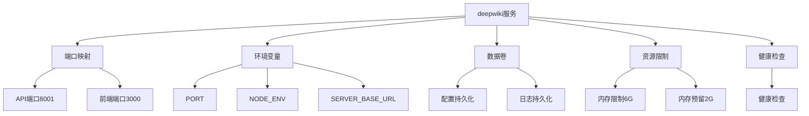
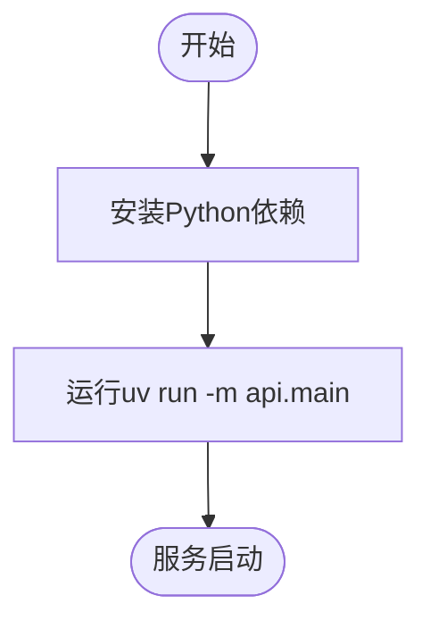
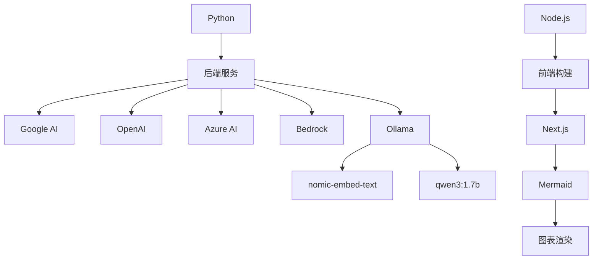

# 部署架构

<cite>
**本文档中引用的文件**  
- [Dockerfile](file://Dockerfile)
- [Dockerfile-ollama-local](file://Dockerfile-ollama-local)
- [docker-compose.yml](file://docker-compose.yml)
- [run.sh](file://run.sh)
- [api/main.py](file://api/main.py)
- [api/config.py](file://api/config.py)
- [next.config.ts](file://next.config.ts)
</cite>

## 目录
1. [简介](#简介)
2. [项目结构](#项目结构)
3. [核心组件](#核心组件)
4. [架构概述](#架构概述)
5. [详细组件分析](#详细组件分析)
6. [依赖分析](#依赖分析)
7. [性能考虑](#性能考虑)
8. [故障排除指南](#故障排除指南)
9. [结论](#结论)

## 简介
本文档详细说明了 DeepWiki 系统的容器化部署方案。重点分析了后端 API 镜像的构建方式、本地 Ollama 集成的支持机制、服务编排配置、生产环境部署建议以及非容器环境下的启动逻辑。同时对比了开发模式与生产模式的部署差异，并提供了高可用部署和 CI/CD 集成的扩展思路。

## 项目结构
DeepWiki 项目采用前后端分离架构，包含一个基于 FastAPI 的 Python 后端和一个基于 Next.js 的前端。项目根目录下包含多个关键部署文件，用于支持容器化和非容器化部署。

**Diagram sources**  
- [Dockerfile](file://Dockerfile)
- [Dockerfile-ollama-local](file://Dockerfile-ollama-local)
- [docker-compose.yml](file://docker-compose.yml)
- [run.sh](file://run.sh)

**Section sources**
- [Dockerfile](file://Dockerfile)
- [Dockerfile-ollama-local](file://Dockerfile-ollama-local)
- [docker-compose.yml](file://docker-compose.yml)
- [run.sh](file://run.sh)

## 核心组件
系统的核心组件包括后端 API 服务、前端 Next.js 应用、Ollama 本地模型服务以及配置管理系统。后端 API 使用 FastAPI 框架提供流式聊天接口，前端使用 Next.js 构建用户界面，两者通过反向代理进行通信。

**Section sources**
- [api/main.py](file://api/main.py)
- [src/app/page.tsx](file://src/app/page.tsx)
- [next.config.ts](file://next.config.ts)

## 架构概述
DeepWiki 采用微服务架构，通过 Docker 容器化技术实现组件隔离和部署灵活性。系统主要由 API 服务、前端服务和可选的本地 Ollama 服务组成，通过 docker-compose 进行服务编排。

**Diagram sources**  
- [Dockerfile](file://Dockerfile)
- [Dockerfile-ollama-local](file://Dockerfile-ollama-local)
- [docker-compose.yml](file://docker-compose.yml)

## 详细组件分析

### 后端API构建分析
Dockerfile 采用多阶段构建策略，分别处理前端和后端的依赖安装与构建过程，最终生成一个包含完整应用的轻量级镜像。

**Diagram sources**  
- [Dockerfile](file://Dockerfile#L1-L107)

**Section sources**
- [Dockerfile](file://Dockerfile#L1-L107)
- [api/main.py](file://api/main.py#L1-L79)

### 本地Ollama集成分析
Dockerfile-ollama-local 在标准镜像基础上集成了 Ollama 服务，支持在本地运行 AI 模型，实现离线或私有化部署。

**Diagram sources**  
- [Dockerfile-ollama-local](file://Dockerfile-ollama-local#L1-L116)

**Section sources**
- [Dockerfile-ollama-local](file://Dockerfile-ollama-local#L1-L116)
- [api/config.py](file://api/config.py#L1-L387)

### 服务编排分析
docker-compose.yml 定义了服务的运行时配置，包括端口映射、环境变量、数据卷和资源限制。

**Diagram sources**  
- [docker-compose.yml](file://docker-compose.yml#L1-L29)

**Section sources**
- [docker-compose.yml](file://docker-compose.yml#L1-L29)
- [next.config.ts](file://next.config.ts#L1-L70)

### 非容器环境启动分析
run.sh 脚本提供了在非容器环境中直接启动后端服务的简便方式，适用于开发和调试场景。

**Diagram sources**  
- [run.sh](file://run.sh#L1)

**Section sources**
- [run.sh](file://run.sh#L1)
- [api/main.py](file://api/main.py#L1-L79)

## 依赖分析
系统依赖关系复杂，涉及多个外部服务和本地组件的集成。通过多阶段 Docker 构建和环境变量配置，实现了依赖的灵活管理。

**Diagram sources**  
- [Dockerfile](file://Dockerfile)
- [Dockerfile-ollama-local](file://Dockerfile-ollama-local)
- [api/config.py](file://api/config.py)

**Section sources**
- [Dockerfile](file://Dockerfile)
- [Dockerfile-ollama-local](file://Dockerfile-ollama-local)
- [api/config.py](file://api/config.py)

## 性能考虑
生产环境部署时需要考虑资源分配、持久化存储、网络设置和安全策略等关键因素。

### 生产环境部署建议
- **资源分配**：建议至少分配 4GB 内存，可根据负载调整至 6GB
- **持久化存储**：配置数据卷以持久化配置文件和日志
- **网络设置**：正确配置端口映射和反向代理
- **安全策略**：通过环境变量管理敏感信息，避免硬编码

### 开发模式与生产模式对比
| 特性 | 开发模式 | 生产模式 |
|------|----------|----------|
| 热重载 | 启用 | 禁用 |
| 日志级别 | DEBUG | INFO |
| 前端构建 | 开发服务器 | 静态构建 |
| 内存限制 | 无 | 6GB |
| 错误显示 | 详细 | 简化 |

**Section sources**
- [Dockerfile](file://Dockerfile)
- [docker-compose.yml](file://docker-compose.yml)
- [api/main.py](file://api/main.py)

## 故障排除指南
常见部署问题及解决方案：

1. **环境变量缺失**：确保设置 OPENAI_API_KEY 和 GOOGLE_API_KEY
2. **端口冲突**：检查 8001 和 3000 端口是否被占用
3. **构建失败**：确认网络连接正常，依赖下载无阻塞
4. **Ollama 模型加载失败**：检查架构匹配和磁盘空间

**Section sources**
- [Dockerfile](file://Dockerfile)
- [Dockerfile-ollama-local](file://Dockerfile-ollama-local)
- [api/main.py](file://api/main.py)

## 结论
DeepWiki 提供了灵活的部署方案，支持从本地开发到生产环境的完整生命周期。通过容器化技术实现了环境一致性，同时提供了非容器化选项以满足不同需求。建议生产环境使用 docker-compose 部署，并根据实际负载调整资源配置。