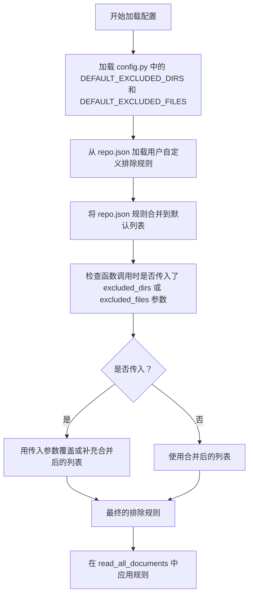
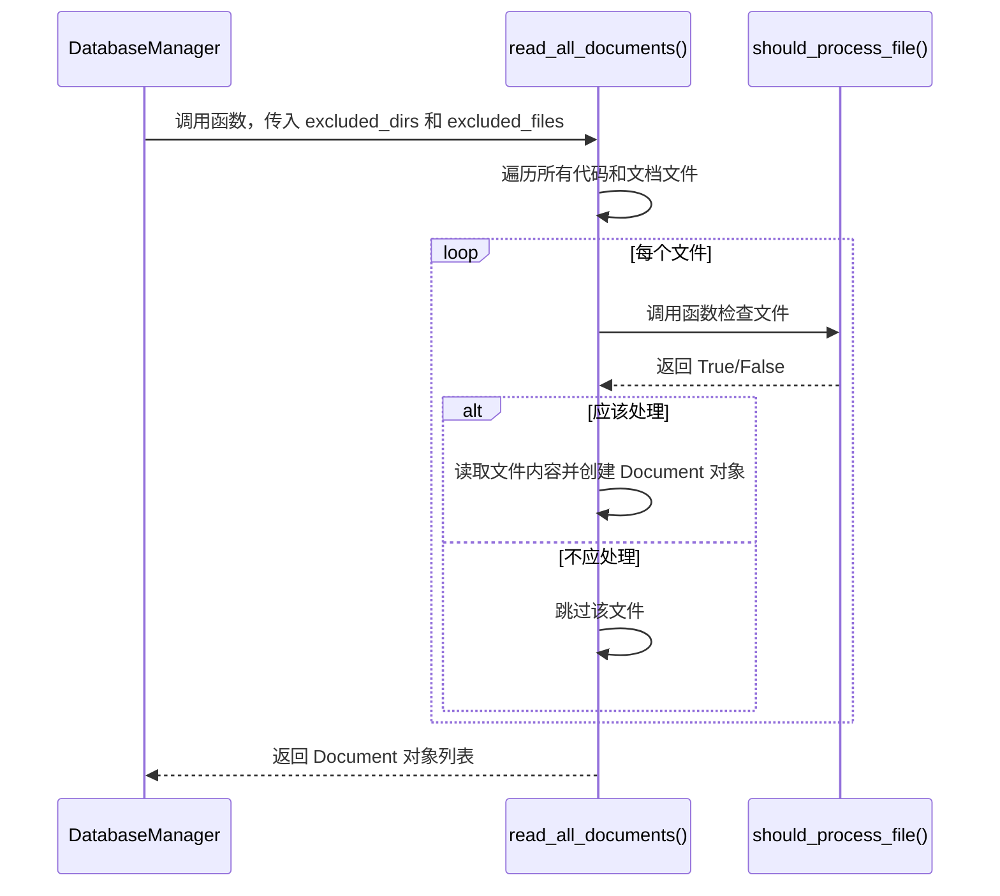

# 仓库配置

<cite>
**本文档中引用的文件**  
- [repo.json](file://api/config/repo.json)
- [config.py](file://api/config.py)
- [data_pipeline.py](file://api/data_pipeline.py)
</cite>

## 目录
1. [简介](#简介)
2. [文件过滤机制](#文件过滤机制)
3. [仓库大小限制](#仓库大小限制)
4. [配置合并与覆盖逻辑](#配置合并与覆盖逻辑)
5. [数据处理流程中的应用](#数据处理流程中的应用)
6. [自定义过滤规则实践](#自定义过滤规则实践)
7. [配置粒度分析](#配置粒度分析)
8. [总结](#总结)

## 简介
`repo.json` 文件在代码库分析过程中扮演着关键角色，它定义了文件过滤规则和仓库大小限制等核心配置。这些配置通过 `config.py` 中的加载机制被集成到系统中，并在 `data_pipeline.py` 的数据处理流程中实际应用。本文档深入解析这些配置的作用机制、合并逻辑及其在系统中的具体实现方式。

## 文件过滤机制

`repo.json` 文件中的 `file_filters` 部分定义了 `excluded_dirs` 和 `excluded_files` 两个列表，用于指定在代码库分析过程中需要忽略的目录和文件模式。这些过滤规则旨在排除无关文件，如依赖管理目录（`node_modules`）、版本控制目录（`.git`）、锁文件（`yarn.lock`）以及编译产物（`*.pyc`）等，从而确保分析过程聚焦于源代码和文档内容。

**Section sources**
- [repo.json](file://api/config/repo.json#L2-L128)

## 仓库大小限制

`repository` 对象中的 `max_size_mb` 参数（值为 50000）用于设置单个代码库的最大允许大小（以 MB 为单位）。这一配置作为防止资源耗尽的安全措施，确保系统在处理大型仓库时不会因内存或存储资源不足而崩溃。该限制在数据处理流程中被用来评估仓库的可行性，超出此限制的仓库将被拒绝处理。

**Section sources**
- [repo.json](file://api/config/repo.json#L129-L131)

## 配置合并与覆盖逻辑

`repo.json` 中定义的过滤规则与 `config.py` 中的 `DEFAULT_EXCLUDED_DIRS` 和 `DEFAULT_EXCLUDED_FILES` 进行合并与覆盖。具体逻辑如下：系统首先加载 `config.py` 中定义的默认排除列表，然后从 `repo.json` 中读取用户自定义的排除规则，并将其添加到默认列表中。如果用户在调用分析功能时显式提供了额外的排除目录或文件，则这些显式参数会进一步覆盖或补充配置文件中的规则。这种分层合并机制提供了灵活性，允许用户在全局默认值的基础上进行个性化调整。

**Diagram sources**
- [config.py](file://api/config.py#L262-L300)
- [repo.json](file://api/config/repo.json#L2-L128)
- [data_pipeline.py](file://api/data_pipeline.py#L143-L370)

**Section sources**
- [config.py](file://api/config.py#L262-L300)
- [repo.json](file://api/config/repo.json#L2-L128)

## 数据处理流程中的应用

配置在 `data_pipeline.py` 的文件读取逻辑中被实际应用。`read_all_documents` 函数负责递归读取目录中的所有文档，它接收 `excluded_dirs` 和 `excluded_files` 参数，并利用这些参数来决定哪些文件应该被处理。该函数内部通过 `should_process_file` 辅助函数检查每个文件路径是否匹配任何排除模式。如果文件路径包含在排除目录列表中，或文件名匹配排除文件模式，则该文件将被跳过。此外，`prepare_db_index` 方法在构建数据库索引时调用 `read_all_documents`，并将配置的过滤规则传递给它，确保整个数据处理流程遵循预设的过滤策略。

**Diagram sources**
- [data_pipeline.py](file://api/data_pipeline.py#L143-L370)
- [data_pipeline.py](file://api/data_pipeline.py#L815-L866)

**Section sources**
- [data_pipeline.py](file://api/data_pipeline.py#L143-L370)
- [data_pipeline.py](file://api/data_pipeline.py#L815-L866)

## 自定义过滤规则实践

用户可以通过修改 `repo.json` 文件来自定义过滤规则，以排除特定的测试目录或日志文件。例如，若要排除所有名为 `test_logs` 的目录和 `.log` 后缀的文件，可以在 `excluded_dirs` 列表中添加 `"./test_logs/"`，并在 `excluded_files` 列表中添加 `"*.log"`。此外，在调用 `prepare_database` 或 `prepare_db_index` 方法时，也可以通过 `excluded_dirs` 和 `excluded_files` 参数动态传入新的忽略模式，这为临时或特定场景下的过滤需求提供了便利。

**Section sources**
- [repo.json](file://api/config/repo.json#L2-L128)
- [data_pipeline.py](file://api/data_pipeline.py#L701-L880)

## 配置粒度分析

当前的配置机制是全局性的，而非针对单个仓库的。这意味着 `repo.json` 文件中定义的 `file_filters` 和 `max_size_mb` 等设置将应用于所有被分析的代码库。系统没有为每个仓库提供独立的配置文件或配置覆盖机制。这种设计简化了配置管理，但牺牲了针对特定仓库进行精细化配置的能力。所有仓库共享同一套过滤规则和大小限制，这在处理具有不同结构或需求的多个仓库时可能成为一个限制。

**Section sources**
- [repo.json](file://api/config/repo.json#L1-L131)
- [config.py](file://api/config.py#L229-L230)

## 总结
`repo.json` 文件是代码库分析流程的核心配置文件，它通过定义文件过滤规则和仓库大小限制来确保分析过程的效率和安全性。其过滤规则与 `config.py` 中的默认值合并，并在 `data_pipeline.py` 的 `read_all_documents` 函数中被实际执行。尽管该配置系统提供了通过文件和函数参数进行自定义的灵活性，但其全局性的设计意味着无法为单个仓库设置独立的配置。理解这一机制对于有效使用和定制该分析工具至关重要。