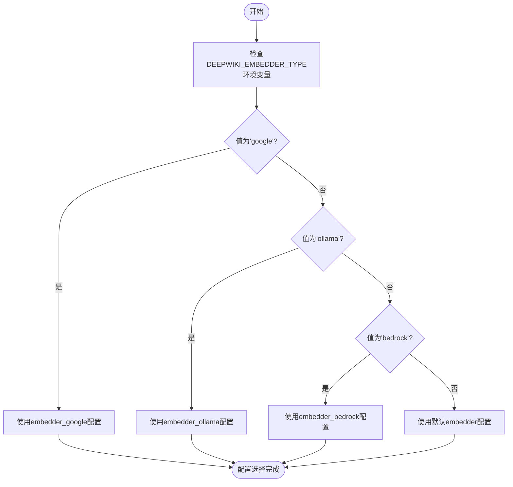
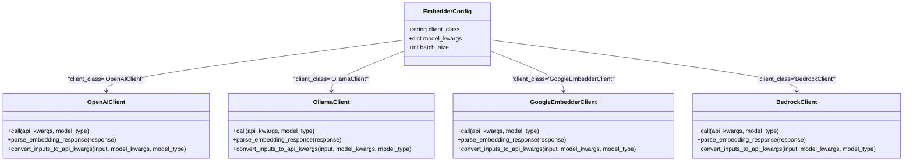
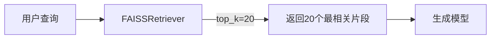
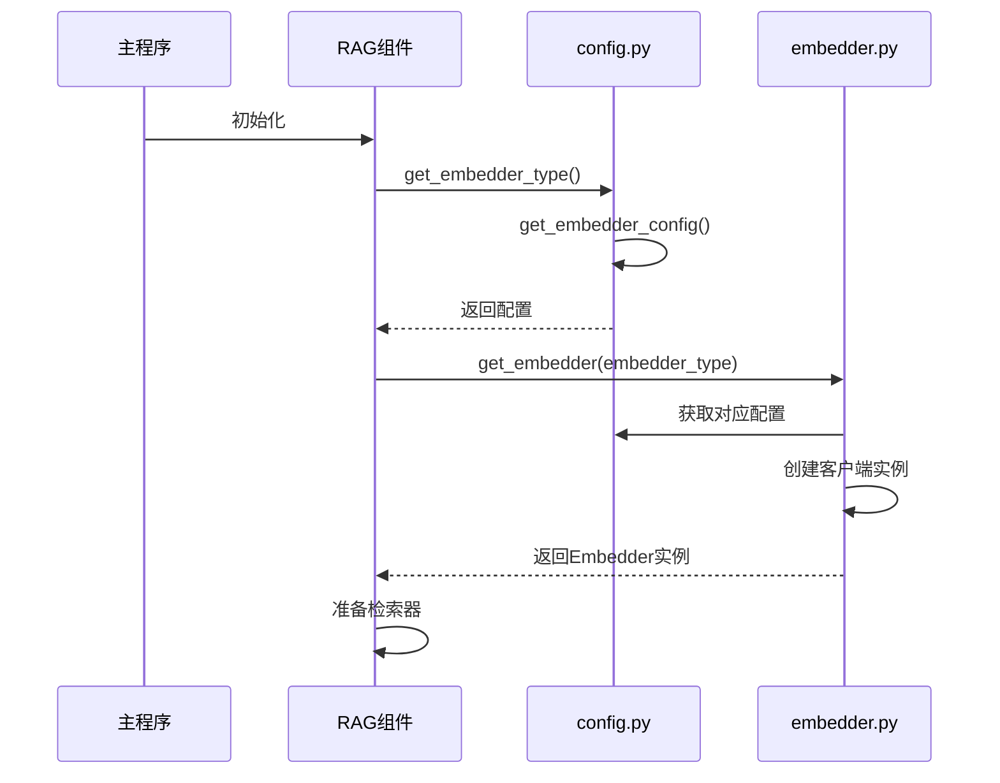

# 嵌入器配置

<cite>
**Referenced Files in This Document**   
- [embedder.json](file://api/config/embedder.json)
- [config.py](file://api/config.py)
- [bedrock_client.py](file://api/bedrock_client.py)
- [embedder.py](file://api/tools/embedder.py)
- [rag.py](file://api/rag.py)
</cite>

## 更新摘要
**变更内容**   
- 新增`embedder_bedrock`配置块的详细说明
- 更新嵌入器选择机制以包含Bedrock选项
- 添加Bedrock客户端类映射说明
- 更新配置切换指南以包含Bedrock选项

## 目录
1. [嵌入器配置概览](#嵌入器配置概览)
2. [配置块详解](#配置块详解)
3. [嵌入器选择机制](#嵌入器选择机制)
4. [客户端类映射](#客户端类映射)
5. [模型参数解析](#模型参数解析)
6. [检索器与文本分割器](#检索器与文本分割器)
7. [运行时配置解析](#运行时配置解析)
8. [配置切换指南](#配置切换指南)

## 嵌入器配置概览

`embedder.json`文件是RAG系统中向量化过程的核心配置文件，定义了不同嵌入模型的参数、检索策略和文本处理规则。该文件通过环境变量`DEEPWIKI_EMBEDDER_TYPE`动态选择具体的嵌入器配置，支持OpenAI、Ollama、Google和Bedrock四种嵌入服务。配置文件不仅指定了模型名称和维度等关键参数，还定义了文本分割策略和检索返回数量，直接影响系统的检索质量和性能表现。

**Section sources**
- [embedder.json](file://api/config/embedder.json#L1-L42)

## 配置块详解

`embedder.json`文件包含四个主要的嵌入器配置块：`embedder`、`embedder_ollama`、`embedder_google`和`embedder_bedrock`，分别对应不同的嵌入服务提供商。

### OpenAI嵌入器配置

`embedder`配置块专为OpenAI服务设计，配置了`OpenAIClient`作为客户端类，使用`text-embedding-3-small`模型，向量维度为256。该配置通过`batch_size`设置批量处理大小为500，优化了向量化效率。`encoding_format`指定为`float`，确保向量以浮点数格式存储。

**Section sources**
- [embedder.json](file://api/config/embedder.json#L2-L10)

### Ollama嵌入器配置

`embedder_ollama`配置块针对本地Ollama服务，使用`OllamaClient`作为客户端类，模型名称为`nomic-embed-text`。与OpenAI配置不同，Ollama配置未指定维度和编码格式，依赖Ollama服务的默认设置。该配置块支持在本地环境中运行嵌入模型，无需外部API调用。

**Section sources**
- [embedder.json](file://api/config/embedder.json#L11-L17)

### Google嵌入器配置

`embedder_google`配置块为Google AI服务配置，使用`GoogleEmbedderClient`作为客户端类，模型名称为`text-embedding-004`，批量大小为100。该配置特别指定了`task_type`为`SEMANTIC_SIMILARITY`，表明模型专为语义相似性任务优化，适用于检索场景。

**Section sources**
- [embedder.json](file://api/config/embedder.json#L18-L25)

### Bedrock嵌入器配置

`embedder_bedrock`配置块为AWS Bedrock服务配置，使用`BedrockClient`作为客户端类，模型名称为`amazon.titan-embed-text-v2:0`，批量大小为100。该配置指定了256维的向量输出，与OpenAI配置保持一致，确保在不同服务间切换时向量空间的兼容性。此配置块的添加扩展了系统的云服务支持能力，使用户能够利用AWS的嵌入模型服务。

**Section sources**
- [embedder.json](file://api/config/embedder.json#L25-L31)

## 嵌入器选择机制

系统通过环境变量`DEEPWIKI_EMBEDDER_TYPE`决定使用哪个嵌入器配置。该机制在`config.py`文件中的`get_embedder_config()`函数中实现，根据环境变量的值选择对应的配置块。

**Diagram sources**
- [config.py](file://api/config.py#L165-L180)

**Section sources**
- [config.py](file://api/config.py#L165-L180)

## 客户端类映射

`client_class`字段在配置文件中指定了具体的客户端类，这些类在运行时被映射到实际的Python类，驱动向量化过程。系统通过`CLIENT_CLASSES`字典维护了类名到实际类的映射关系。

**Diagram sources**
- [config.py](file://api/config.py#L55-L65)
- [openai_client.py](file://api/openai_client.py#L119-L586)
- [google_embedder_client.py](file://api/google_embedder_client.py#L19-L230)
- [bedrock_client.py](file://api/bedrock_client.py#L20-L467)

**Section sources**
- [config.py](file://api/config.py#L55-L65)

## 模型参数解析

`model_kwargs`中的参数对嵌入模型的行为和性能有重要影响，不同模型提供商支持的参数有所不同。

### 模型名称与维度

`text-embedding-3-small`是OpenAI提供的高效嵌入模型，256维的向量在保持良好语义表示的同时显著降低了存储和计算成本。相比之下，Google的`text-embedding-004`模型未在配置中指定维度，使用其默认的高维表示，可能提供更精细的语义区分能力。对于Bedrock服务，`amazon.titan-embed-text-v2:0`是Amazon Titan系列的嵌入模型，同样配置为256维，确保了向量空间的一致性。

**Section sources**
- [embedder.json](file://api/config/embedder.json#L7)

### 任务类型参数

`task_type`参数是Google嵌入器特有的配置，`SEMANTIC_SIMILARITY`值指示模型优化语义相似性计算，这对于检索任务至关重要。该参数确保模型生成的向量在语义空间中距离相近的文本具有相似的向量表示。

**Section sources**
- [embedder.json](file://api/config/embedder.json#L24)

## 检索器与文本分割器

除了嵌入器配置，文件还定义了检索和文本处理策略，这些策略共同决定了RAG系统的整体性能。

### 检索器配置

`retriever`配置块中的`top_k`参数设置为20，控制从向量数据库返回的上下文片段数量。这个值需要在信息丰富度和计算开销之间取得平衡：值过小可能导致上下文不足，值过大则增加生成模型的处理负担。

**Diagram sources**
- [embedder.json](file://api/config/embedder.json#L32-L34)
- [rag.py](file://api/rag.py#L385-L390)

**Section sources**
- [embedder.json](file://api/config/embedder.json#L32-L34)

### 文本分割器配置

`text_splitter`配置定义了文本预处理策略，`chunk_size`为350，`chunk_overlap`为100，`split_by`为`word`。这种配置确保文本按单词边界分割，每个片段平均350个单词，相邻片段有100个单词的重叠，既保持了上下文连贯性，又避免了信息碎片化。

**Section sources**
- [embedder.json](file://api/config/embedder.json#L35-L39)

## 运行时配置解析

系统的配置解析流程在`config.py`和`embedder.py`文件中实现，通过一系列函数协调完成配置的加载和应用。

**Diagram sources**
- [config.py](file://api/config.py#L165-L192)
- [embedder.py](file://api/tools/embedder.py#L5-L65)
- [rag.py](file://api/rag.py#L171-L191)

**Section sources**
- [config.py](file://api/config.py#L165-L192)
- [embedder.py](file://api/tools/embedder.py#L5-L65)

## 配置切换指南

切换嵌入模型需要修改环境变量和配置文件，以下是具体步骤：

1. **切换到Google嵌入器**：设置`DEEPWIKI_EMBEDDER_TYPE=google`，确保`GOOGLE_API_KEY`环境变量已配置。
2. **切换到Ollama嵌入器**：设置`DEEPWIKI_EMBEDDER_TYPE=ollama`，确保Ollama服务正在运行且已拉取`nomic-embed-text`模型。
3. **切换到OpenAI嵌入器**：设置`DEEPWIKI_EMBEDDER_TYPE=openai`，确保`OPENAI_API_KEY`环境变量已配置。
4. **切换到Bedrock嵌入器**：设置`DEEPWIKI_EMBEDDER_TYPE=bedrock`，确保AWS凭证环境变量（`AWS_ACCESS_KEY_ID`、`AWS_SECRET_ACCESS_KEY`、`AWS_REGION`等）已正确配置。

**Section sources**
- [config.py](file://api/config.py#L165-L180)
- [embedder.json](file://api/config/embedder.json#L1-L42)