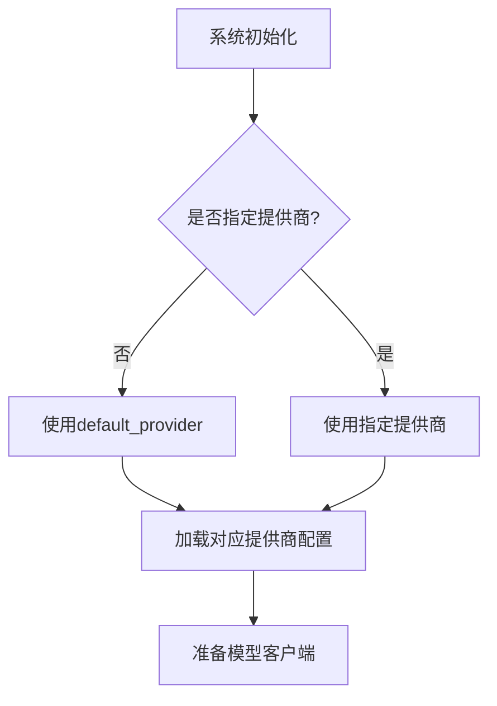
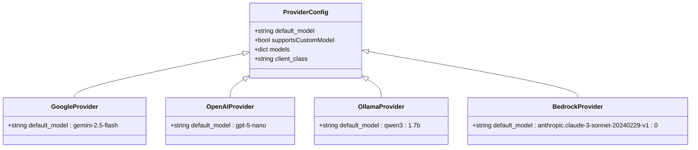
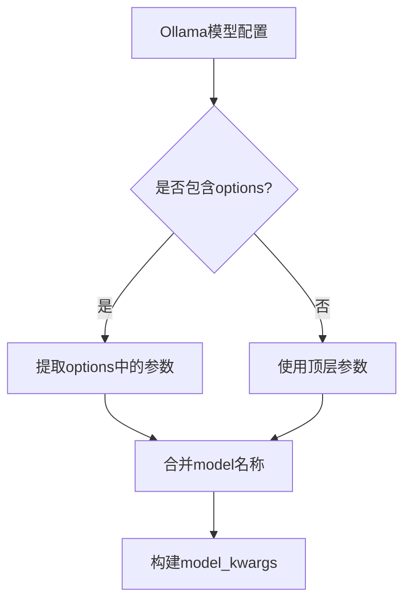
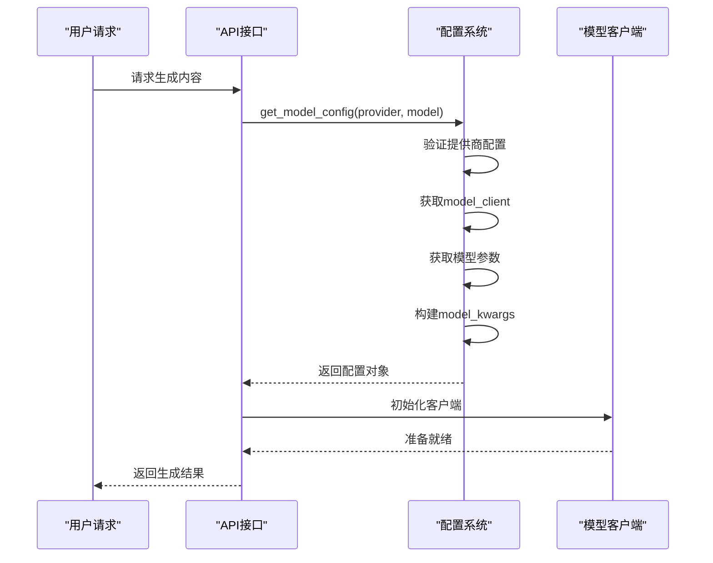
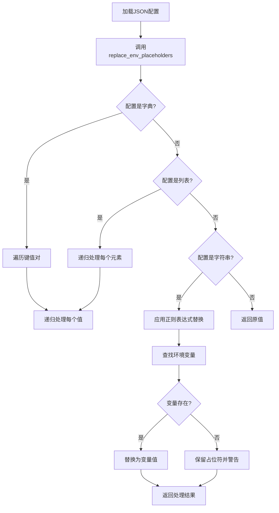
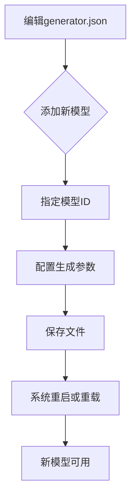

# 生成器配置

<cite>
**Referenced Files in This Document**   
- [generator.json](file://api/config/generator.json)
- [config.py](file://api/config.py)
</cite>

## 目录
1. [简介](#简介)
2. [配置文件结构](#配置文件结构)
3. [默认提供商机制](#默认提供商机制)
4. [提供商配置详解](#提供商配置详解)
5. [模型参数与生成配置](#模型参数与生成配置)
6. [Ollama特殊配置](#ollama特殊配置)
7. [运行时配置加载](#运行时配置加载)
8. [环境变量替换机制](#环境变量替换机制)
9. [性能调优建议](#性能调优建议)
10. [扩展与自定义](#扩展与自定义)

## 简介
本文档深入解析`generator.json`配置文件的结构与功能，详细说明其在系统中的作用。重点阐述默认提供商的指定机制、各提供商的配置结构、模型生成参数的设置，以及运行时如何动态加载配置。同时，文档还涵盖了环境变量替换机制和性能调优建议，为开发者提供全面的配置指导。

## 配置文件结构
`generator.json`文件定义了系统中所有可用的生成模型提供商及其配置。该文件采用JSON格式，主要包含两个顶级字段：`default_provider`和`providers`。`default_provider`指定系统初始化时使用的默认LLM提供商，而`providers`对象则包含了所有可用提供商的详细配置。

**Section sources**
- [generator.json](file://api/config/generator.json#L1-L200)

## 默认提供商机制
`default_provider`字段用于指定系统启动时默认使用的LLM提供商。在当前配置中，该值被设置为"google"，意味着系统将默认使用Google的Gemini系列模型进行文本生成。此设置在系统初始化和用户未明确指定提供商时起作用，确保系统始终有一个可用的默认模型。

**Diagram sources**
- [generator.json](file://api/config/generator.json#L1-L2)
- [config.py](file://api/config.py#L303-L303)

**Section sources**
- [generator.json](file://api/config/generator.json#L1-L5)

## 提供商配置详解
`providers`对象包含了每个LLM提供商的详细配置，其结构具有一致性但又允许特殊定制。每个提供商的配置包含以下核心字段：

- `default_model`: 指定该提供商的默认模型
- `supportsCustomModel`: 布尔值，指示是否支持自定义模型
- `models`: 包含该提供商所有可用模型及其生成参数的字典
- `client_class` (可选): 指定用于该提供商的客户端类

**Diagram sources**
- [generator.json](file://api/config/generator.json#L6-L199)
- [config.py](file://api/config.py#L54-L63)

**Section sources**
- [generator.json](file://api/config/generator.json#L6-L199)

## 模型参数与生成配置
每个提供商的`models`字典中定义了各个模型的生成参数。这些参数直接影响模型的输出质量和风格。主要参数包括：

- `temperature`: 控制输出的随机性，值越高输出越随机
- `top_p`: 核采样参数，控制考虑的词汇比例
- `top_k`: 限制考虑的最高概率词汇数量
- `num_ctx`: 上下文窗口大小（特定于某些提供商）

不同提供商的模型参数设置体现了其性能特点。例如，Google的Gemini模型设置了`top_k`参数，而OpenAI的模型则主要使用`temperature`和`top_p`组合。

**Section sources**
- [generator.json](file://api/config/generator.json#L20-L199)

## Ollama特殊配置
Ollama提供商在配置结构上与其他提供商有所不同，采用了嵌套的`options`结构来组织生成参数。这种设计允许更灵活的参数组织方式，特别适合Ollama本地运行环境的特殊需求。

**Diagram sources**
- [generator.json](file://api/config/generator.json#L138-L159)
- [config.py](file://api/config.py#L367-L372)

**Section sources**
- [generator.json](file://api/config/generator.json#L138-L159)

## 运行时配置加载
系统通过`config.py`中的`get_model_config()`函数实现运行时动态配置加载。该函数根据指定的提供商和模型名称，从已加载的配置中提取相应的客户端和参数，构建完整的模型配置对象。

**Diagram sources**
- [config.py](file://api/config.py#L333-L386)
- [config.py](file://api/config.py#L120-L144)

**Section sources**
- [config.py](file://api/config.py#L333-L386)

## 环境变量替换机制
系统实现了强大的环境变量替换机制，允许在配置文件中使用`${ENV_VAR}`格式的占位符。`replace_env_placeholders()`函数会递归遍历配置结构，将占位符替换为实际的环境变量值，这为敏感信息（如API密钥）的安全管理提供了便利。

**Diagram sources**
- [config.py](file://api/config.py#L65-L93)
- [config.py](file://api/config.py#L120-L144)

**Section sources**
- [config.py](file://api/config.py#L65-L93)

## 性能调优建议
在高并发场景下，合理设置生成参数对系统性能和输出质量至关重要。以下是一些调优建议：

- **Temperature设置**: 对于需要一致性的场景（如文档生成），建议设置较低的temperature（0.3-0.7）；对于创意性任务，可适当提高（0.7-1.0）
- **Top_p与Top_k权衡**: Top_p更适合控制输出多样性，而Top_k更适合限制计算复杂度。在高并发场景下，建议优先使用Top_p进行控制
- **上下文管理**: 合理设置`num_ctx`参数，避免过大的上下文窗口导致内存压力
- **默认模型选择**: 选择响应速度快、成本效益高的模型作为默认模型，如Gemini Flash或GPT-5 Nano

**Section sources**
- [generator.json](file://api/config/generator.json#L20-L199)

## 扩展与自定义
添加新模型或自定义生成参数非常简单。只需在相应提供商的`models`字典中添加新的模型条目，并配置所需的生成参数即可。系统会自动识别并加载新配置，无需修改代码。

**Diagram sources**
- [generator.json](file://api/config/generator.json#L1-L199)
- [config.py](file://api/config.py#L333-L386)

**Section sources**
- [generator.json](file://api/config/generator.json#L1-L199)
- [config.py](file://api/config.py#L333-L386)