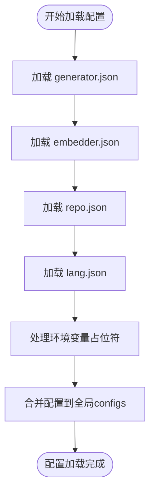

# 配置管理

<cite>
**Referenced Files in This Document**   
- [generator.json](file://api/config/generator.json)
- [embedder.json](file://api/config/embedder.json)
- [lang.json](file://api/config/lang.json)
- [repo.json](file://api/config/repo.json)
- [config.py](file://api/config.py)
</cite>

## 目录
1. [核心配置文件](#核心配置文件)
2. [配置加载机制](#配置加载机制)
3. [环境变量](#环境变量)
4. [自定义配置目录](#自定义配置目录)
5. [配置热更新](#配置热更新)
6. [最佳实践](#最佳实践)

## 核心配置文件

系统通过四个核心JSON文件管理不同方面的配置，这些文件位于`api/config/`目录下。

### `generator.json`: LLM生成模型配置

该文件管理大型语言模型（LLM）的生成参数，支持多个提供商和模型。每个提供商（如google、openai、ollama等）可配置默认模型和特定模型参数。

**主要配置项**：
- `default_provider`: 默认使用的模型提供商
- `providers`: 各提供商的详细配置，包括：
  - `default_model`: 该提供商的默认模型
  - `models`: 具体模型的参数，如`temperature`（温度）、`top_p`（核采样）等生成参数

**Section sources**
- [generator.json](file://api/config/generator.json)

### `embedder.json`: 嵌入模型与文本分割器配置

该文件配置嵌入模型和文本处理组件，支持多种嵌入服务提供商。

**主要配置项**：
- `embedder`: 主嵌入器配置，指定客户端类和模型参数
- `embedder_ollama`: Ollama嵌入器专用配置
- `embedder_google`: Google嵌入器专用配置
- `retriever`: 检索器配置，如`top_k`参数
- `text_splitter`: 文本分割器配置，包括`chunk_size`（块大小）和`chunk_overlap`（块重叠）

**Section sources**
- [embedder.json](file://api/config/embedder.json)

### `lang.json`: 多语言支持配置

该文件定义系统支持的语言选项和默认语言。

**主要配置项**：
- `supported_languages`: 支持的语言列表，以语言代码为键，显示名称为值
- `default`: 系统默认语言代码

**Section sources**
- [lang.json](file://api/config/lang.json)

### `repo.json`: 文件过滤规则配置

该文件控制仓库文件的过滤规则和仓库大小限制。

**主要配置项**：
- `file_filters`: 文件过滤规则，包括：
  - `excluded_dirs`: 排除的目录列表
  - `excluded_files`: 排除的文件列表
- `repository`: 仓库配置，如`max_size_mb`（最大大小，单位MB）

**Section sources**
- [repo.json](file://api/config/repo.json)

## 配置加载机制

`config.py`是系统配置管理的核心模块，负责加载和管理所有配置。

### 配置加载流程



**Diagram sources**
- [config.py](file://api/config.py#L120-L259)

### 环境变量占位符处理

系统支持在JSON配置文件中使用`${ENV_VAR}`格式的环境变量占位符。`replace_env_placeholders`函数会递归地将这些占位符替换为实际的环境变量值。

```mermaid
flowchart TD
A[开始替换] --> B{配置项是字典?}
B --> |是| C[遍历键值对<br>递归替换值]
B --> |否| D{配置项是列表?}
D --> |是| E[遍历每个元素<br>递归替换]
D --> |否| F{配置项是字符串?}
F --> |是| G[用正则表达式<br>替换${ENV_VAR}]
F --> |否| H[保持原样]
G --> I[返回替换结果]
C --> I
E --> I
H --> I
I --> J[返回最终配置]
```

**Diagram sources**
- [config.py](file://api/config.py#L65-L93)

**Section sources**
- [config.py](file://api/config.py#L65-L117)

## 环境变量

系统通过环境变量配置敏感信息和运行时选项。

### API密钥环境变量

- `OPENAI_API_KEY`: OpenAI API密钥
- `GOOGLE_API_KEY`: Google API密钥
- `OPENROUTER_API_KEY`: OpenRouter API密钥
- `AWS_ACCESS_KEY_ID`, `AWS_SECRET_ACCESS_KEY`, `AWS_REGION`, `AWS_ROLE_ARN`: AWS认证信息

这些密钥在程序启动时从环境变量读取，并设置到`os.environ`中供其他组件使用。

### 认证与嵌入器环境变量

- `DEEPWIKI_AUTH_MODE`: 是否启用Wiki认证
- `DEEPWIKI_AUTH_CODE`: Wiki认证码
- `DEEPWIKI_EMBEDDER_TYPE`: 嵌入器类型（openai, ollama, google）

### 端口环境变量

- `PORT`: 服务监听端口（在Docker环境中使用）

**Section sources**
- [config.py](file://api/config.py#L15-L50)

## 自定义配置目录

系统支持通过`DEEPWIKI_CONFIG_DIR`环境变量指定自定义配置目录。

### 使用方法

设置`DEEPWIKI_CONFIG_DIR`环境变量指向自定义配置目录，系统将优先从该目录加载配置文件，而不是默认的`api/config/`目录。

```python
# 在 config.py 中的实现
CONFIG_DIR = os.environ.get('DEEPWIKI_CONFIG_DIR', None)

def load_json_config(filename):
    if CONFIG_DIR:
        config_path = Path(CONFIG_DIR) / filename  # 使用自定义目录
    else:
        config_path = Path(__file__).parent / "config" / filename  # 使用默认目录
```

**Section sources**
- [config.py](file://api/config.py#L51)

## 配置热更新

当前配置系统在应用启动时一次性加载所有配置，并将其存储在内存中的`configs`全局变量里。系统目前**不支持**配置文件的热更新。

### 限制说明

- 配置在启动时加载后，后续对配置文件的修改不会自动反映到运行中的应用
- 要应用新的配置更改，必须重启应用
- 这种设计确保了配置的一致性和性能，避免了运行时配置变化可能带来的状态不一致问题

### 可能的改进方向

未来可通过以下方式实现热更新：
- 监听配置文件的文件系统事件
- 定期重新加载配置文件
- 提供API端点手动触发配置重载

**Section sources**
- [config.py](file://api/config.py#L262-L387)

## 最佳实践

### 配置文件管理

1. **版本控制**: 将配置文件纳入版本控制，但敏感信息应通过环境变量管理
2. **备份**: 定期备份自定义配置
3. **文档**: 为自定义配置添加注释说明

### 环境变量安全

1. **敏感信息**: API密钥等敏感信息绝不应硬编码在配置文件中
2. **.env文件**: 在开发环境中使用`.env`文件管理环境变量，但确保其被`.gitignore`忽略
3. **生产环境**: 在生产环境中通过安全的密钥管理服务或容器编排平台的密钥功能管理环境变量

### 配置优化

1. **性能调优**: 根据实际需求调整`text_splitter`的`chunk_size`和`chunk_overlap`
2. **模型选择**: 根据应用场景选择合适的LLM模型和参数
3. **资源管理**: 合理设置`max_size_mb`以平衡功能和性能

**Section sources**
- [config.py](file://api/config.py)
- [generator.json](file://api/config/generator.json)
- [embedder.json](file://api/config/embedder.json)
- [lang.json](file://api/config/lang.json)
- [repo.json](file://api/config/repo.json)